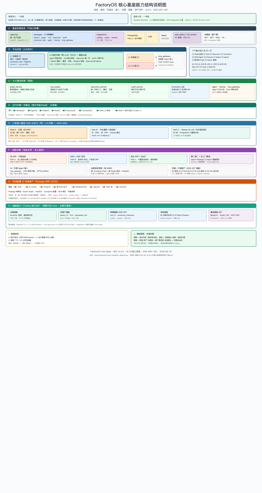
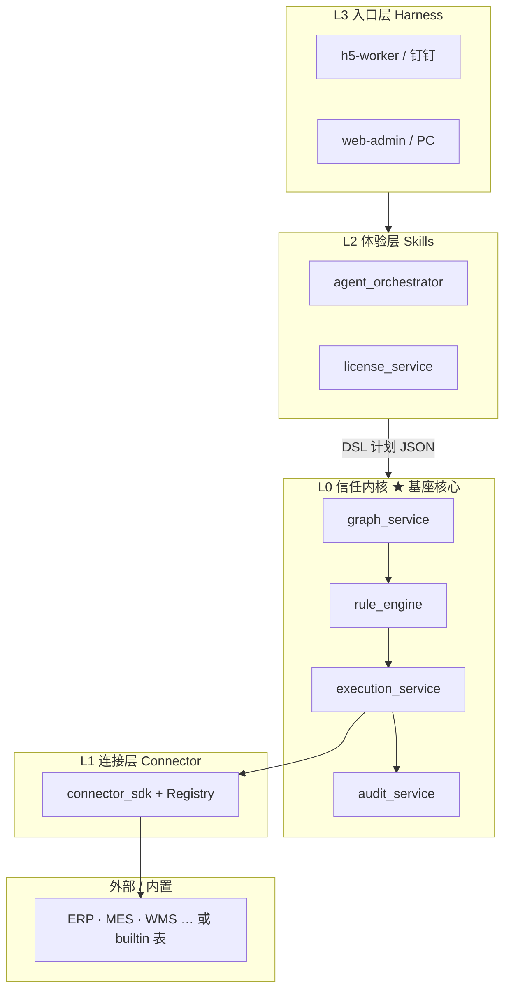
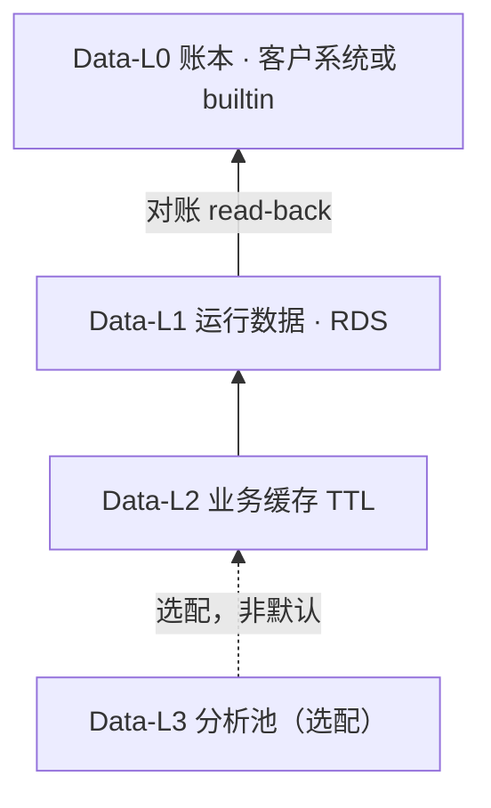
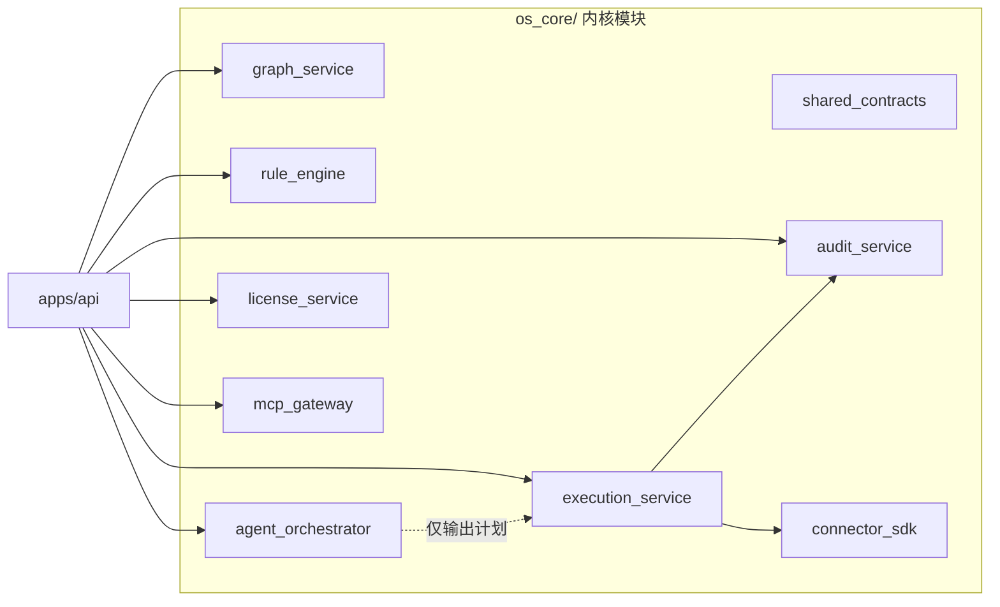
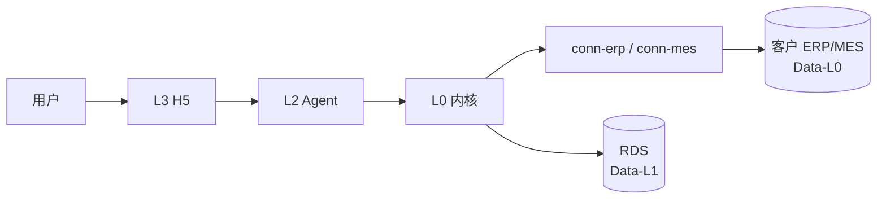
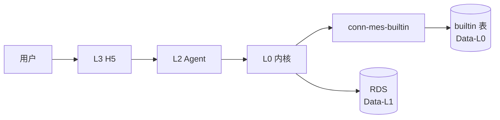
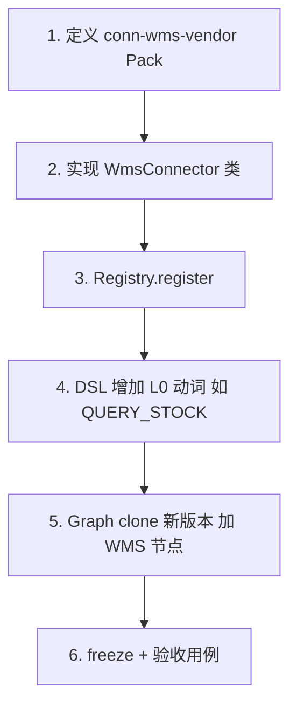
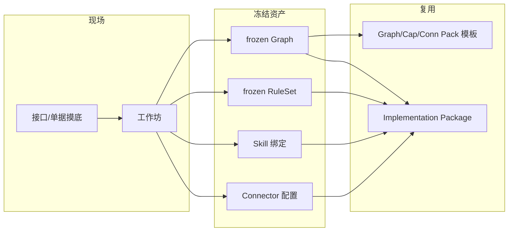

# FactoryOS OS 核心基座架构设计说明

> 版本：**v3.3.3** | 日期：2026-06-16  
> 范围：**仅** OS 核心基座——组成、分层、模块、部署形态、扩展机制  
> 关联：ADR-001 · ADR-002 · ADR-004 · **ADR-005** · [17-GIP](./17-集成平台化战略(GIP).md) · [18-一致性矩阵](./18-基座文档一致性矩阵.md) · AC-BASE-001 v0.2

---

## 0. 基座能力说明总图（一张图读完）

> **建议先读此图**，再读下文各节细节。  
> 文件：[`基座能力说明图.png`](../../文档/架构/基座能力说明图.png)（亦称 **基座能力结构说明图**）· 源文件 [`基座能力说明图.svg`](../../文档/架构/基座能力说明图.svg)

**架构图族（2026-06-16 v2 全量重生成）：**

| 图 | 文件 | 说明文档 |
|----|------|----------|
| 基座能力结构说明图 | `基座能力说明图.png` | 本文 §0 |
| 系统架构图 | `系统架构图.png` | [系统架构图说明](../../文档/架构/系统架构图说明.md) |
| 技术架构图 | `技术架构图.png` | [技术架构图说明](../../文档/架构/技术架构图说明.md) |
| 数据架构图 | `数据架构图.png` | [数据架构图说明](../../文档/架构/数据架构图说明.md) |
| 核心模块架构图 | `核心模块架构图.png` | [核心模块架构图说明](../../文档/架构/核心模块架构图说明.md) |



**图内分区：**

| 区 | 内容 |
|----|------|
| **顶栏** | 非技术人 / 技术人员各一句话读懂 |
| **A** | 基座物理组成（api · **9 个 os_core 模块** · integration/ · RDS/OSS/Redis · 前端） |
| **B** | 平台四层 L0～L3 + mcp_gateway + **能力切入点 ①～⑩** |
| **C** | 九大模块职责（graph / rule / execution / audit / connector / agent·license·mcp） |
| **D** | 运行时唯一写路径（每次写账本必经 · ExecutionEvidence） |
| **E** | 三条写入路径 Path A/B/C + GIP 三速接入 S1/S2/S3 |
| **F** | **适配场景**（有 ERP · 双系统 · 无 ERP · 复制 · Agent/MCP · 百级千级） |
| **G** | 部署 → 冻结 → export → Pack 库 → import **资产闭环 ⑦⑧⑩** + 扩展新系统 **⑨** |
| **H** | **储备能力**（治理 · 多租户 · ADR-007 规模 · 消息 · GIP 契约） |
| **I/J** | 数据四层 + 颜色图例 |

**十个能力切入点：**

```text
① Graph 冻结  ② Rule 授权  ③ Execution 执行  ④ Connector 接入
⑤ Skill/Agent  ⑥ Harness 确认  ⑦ freeze 冻结  ⑧ export 快照
⑨ 新系统 Pack  ⑩ import 复制
```

---

## 1. 基座是什么

FactoryOS 核心基座是一套 **可独立部署的运行时**：在客户现有系统（或内置账本）之上，提供 **统一的流程冻结、权限判定、受控写库、审计与撤回** 能力。

**不是**：ERP/MES 替代品、聊天机器人、业务数仓。

---

## 2. 物理组成一览

```text
┌─────────────────────────────────────────────────────────────────┐
│                     FactoryOS 核心基座（运行时）                    │
├─────────────────────────────────────────────────────────────────┤
│  应用层                                                          │
│    · apps/api          后端 HTTP 服务（FastAPI，唯一生产 deployable）│
│    · apps/web-admin    PC 管理端（Graph freeze、规则、运维）       │
│    · apps/h5-worker    移动端壳（钉钉/企微 H5，调 API）            │
├─────────────────────────────────────────────────────────────────┤
│  内核层    os_core/*   9 个 Python 模块（§4，含 mcp_gateway）       │
├─────────────────────────────────────────────────────────────────┤
│  数据层    PostgreSQL 16   Graph / Rule / 执行记录 / 审计（RDS）   │
│            OSS             语音、图片（短期，不进 PG）               │
│            Redis           会话、对账队列（接口预留，可 stub）       │
└─────────────────────────────────────────────────────────────────┘
          │                                    │
          │ HTTPS                              │ Connector 出站
          ▼                                    ▼
     用户浏览器 / 钉钉                      外部系统 或 内置账本表
```

| 组成项 | 类型 | 说明 |
|--------|------|------|
| `apps/api` + `os_core/*` | **必建** | 基座本体 |
| PostgreSQL | **必建** | Data-L1 运行数据 |
| OSS | **必建** | 多模态媒体 |
| Redis | 预留 | Phase 2 对账 Job 完整启用 |
| `web-admin` / `h5-worker` | Phase 1 后半 | 与 API 分离的前端工程 |
| GitLab / CI | **不属于基座** | 研发测试域设施 |

**仓库结构：**

```text
FactoryOS/
├── apps/
│   ├── api/                 # 1 个后端 deployable（OpenAPI v1.1.1）
│   ├── web-admin/           # PC · Integration Studio 宿主
│   └── h5-worker/           # 钉钉 H5 · Harness
├── os_core/                # Core v1.0 冻结域
│   ├── shared_contracts/
│   ├── graph_service/
│   ├── rule_engine/
│   ├── execution_service/
│   ├── audit_service/
│   ├── connector_sdk/       # Runtime + Registry
│   ├── agent_orchestrator/
│   ├── license_service/
│   └── mcp_gateway/         # Y1 末内部 GA（stub 可早建）
├── integration/             # GIP：Pack · tenant override · Connector 样例
│   ├── catalog/
│   ├── packs/
│   ├── tenants/
│   └── tools/connector-agent/   # S2 · 非 Core
├── tests/                   # AC-BASE-001 等
└── 文档/                    # Schema、OpenAPI v1.1.1 契约
```

**部署形态（Y1）：** 单 VPC · 生产 ECS 跑 API · RDS 跑 PG · 多工厂 = 同一套栈，逻辑隔离 `tenant_id`。

---

## 3. 分层模型（从内到外）

### 3.1 平台四层



| 层 | 名称 | 完成什么任务 | 是否含 LLM |
|----|------|--------------|------------|
| **L0** | 信任内核 | 流程是否冻结、能否执行、怎么写、怎么记、怎么撤 | **否** |
| **L1** | 连接层 | 标准动词 → 各系统 API/表操作 | **否** |
| **L2** | 体验层 | 自然语言/多模态 → **办事计划**（不执行写库） | **是**（仅此层） |
| **L3** | 入口层 | 展示、确认、待办；不含业务规则 | **否** |

### 3.2 数据四层



| 层 | 存什么 | 存在哪 |
|----|--------|--------|
| **Data-L0** | 订单、库存、报工事实 | 客户 ERP/MES，或 B-Lite 内置 PG 表 |
| **Data-L1** | Graph、Rule、ExecutionRecord、Audit、对账 | FactoryOS RDS |
| **Data-L2** | 查询缓存、最小快照 | RDS，TTL |
| **Data-L3** | 全量同步/分析 | 选配，非基座默认 |

### 3.3 唯一写路径

全系统 **只有一条** 生产写库链路：

```text
  用户输入
      ↓
  L3  Harness 确认
      ↓
  L2  Agent 产出 DSL 计划（JSON）
      ↓
  L0  graph：必须 frozen
      ↓
  L0  rule：默认 deny，匹配 allow 才过
      ↓
  L0  execution：Saga 执行
      ↓
  L1  connector.write
      ↓
  Data-L0  外部账本 / builtin 表
      ↓
  L0  audit + ExecutionRecord → Data-L1
```

**红线：** Agent、graph、rule、connector **均不得** 绕过 execution 直写 Data-L0。

---

## 4. 核心模块说明



| 模块 | 职责 | 存在理由 | 扩展方式 |
|------|------|----------|----------|
| **shared_contracts** | 类型、错误码、Schema 加载 | 模块间统一契约 | 随 JSON Schema 演进 |
| **graph_service** | Graph 版本：draft → in_review → **frozen** | 未冻结流程禁止 L2 写 | 新场景 = **clone 新版本** + freeze |
| **rule_engine** | 角色/条件/动作 → allow 或 deny | 默认拒绝，防越权 | 新 RuleSet 版本或 Pack 模板 |
| **execution_service** | **唯一**写 Legacy；Revert；对账；幂等 | 写库、撤回、对账必须同一入口 | 新 **DSL 动词** + Connector 映射 |
| **audit_service** | append-only 日志 | 操作可追溯 | 新 event_type |
| **connector_sdk** | Registry + httpx 适配 | 内核不绑定金蝶/用友语法 | **新 Connector 类 + 注册** |
| **agent_orchestrator** | LangGraph FSM → DSL 计划 | 多轮填槽、意图识别 | 新 **Skill**（新 FSM） |
| **license_service** | Pack 是否已授权 | 模块化加载边界 | 新 pack_id 登记 |
| **mcp_gateway** | CMV → MCP tools；`tools/call` → DslPlan | 治理型 Agent 接入 | 新 CMV 授权子集 |

> **共 9 个** Python 包（含 `shared_contracts`）。GIP Runtime 在 `connector_sdk` + `integration/`，不单独计包。

## 5. 两种接入架构（同一内核）

差别 **仅在 L1 连接目标** 与 **Data-L0 账本位置**；L0～L3 软件栈相同。

### 5.1 有外部系统（Overlay）



| 项 | 说明 |
|----|------|
| Data-L0 | 权威在 **客户 ERP/MES** |
| 写路径 | execution → `conn-erp-*` 或 `conn-mes-*` |
| 典型配置 | 有 MES 厂：MES 写 + ERP 读；仅 ERP 厂：ERP 写+读 |
| 入口 | `conn-dingtalk` 等 IM Pack（L3 通知） |

### 5.2 无外部系统（内置账本）



| 项 | 说明 |
|----|------|
| Data-L0 | **PostgreSQL builtin 表**（工单、报工等） |
| 写路径 | execution → `conn-mes-builtin` |
| L0 机制 | 与 Overlay **完全相同** |

---

## 6. 扩展机制

### 6.1 扩展什么、不动什么

```text
  ┌─────────────────────────────────────┐
  │  不动（基座内核 L0 代码路径固定）       │
  │  graph → rule → execution → audit   │
  └─────────────────────────────────────┘
                    │
        只通过以下机制扩展 ▼
  ┌─────────┬─────────┬─────────┬─────────┐
  │Connector│ Graph   │ Skill   │ DSL     │
  │ Pack    │ 新版本  │ Pack    │ 动词    │
  └─────────┴─────────┴─────────┴─────────┘
```

### 6.2 Legacy 系统类型（枚举固定）

```text
mes · erp · wms · oa · crm · csm · aps · plm · qms · mock
```

新厂商 **不** 增加类型；用 `{system}-{vendor}` 注册，例如 `erp-kingdee`、`wms-flux`。

### 6.3 新增一种系统（例：WMS）的步骤



| 步 | 产物 | 改内核？ |
|----|------|----------|
| Pack 元数据 | `conn-wms-*-read` | 否 |
| Connector 类 | `connector_sdk/wms/` | 否 |
| Registry | 租户绑定 pack → 实例 | 否 |
| DSL | 新动词条目 | 否（只增注册表） |
| Graph | 新版本 frozen | 否（不改旧版） |

**禁止：** `execution_service` 内 `if system == 'wms'`；Agent 调用 `connector.write`。

### 6.4 读写级别

| 级别 | 行为 | 典型 |
|------|------|------|
| L0 | 只读 Legacy | ERP 查工单、WMS 查库位 |
| L2 | 写 + 必须带 Revert 动词 | 报工写入 |
| L3 | 通知/待办 | 钉钉消息 |

---

## 7. 资产形态：Graph · Pack · Skill · Package

部署过程中，现场配置会沉淀为四类可版本化对象：



| 对象 | 是什么 | 存哪 | 怎么复用 |
|------|--------|------|----------|
| **Graph** | 业务流程图（节点=步骤，边=流转） | RDS + 版本号 + checksum | Graph Pack 模板；clone 后 freeze |
| **RuleSet** | 谁能在何条件下执行何动词 | RDS，绑定 graph_version | 随 Graph 版本 |
| **Skill** | Agent 侧一种办事 FSM（如报工） | 代码 + Pack 元数据 | `skill-*` Pack 挂载 |
| **Pack** | 可授权的最小单元（graph/cap/conn/skill） | `文档/商业/packs/` + Registry | 租户 license 勾选加载 |
| **Package** | 某租户完整配置 **快照** | export JSON | 另一 tenant **import** 后差量修改 |

**Graph 生命周期：**

```text
draft ──submit──► in_review ──freeze──► frozen ──clone──► 新 version (draft)
                      │                      │
                      │                      └── deprecated（禁止 L2 写）
                      └── 可编辑节点/边
```

**Package export 内容（快照）：**

```text
graphs[] · rulesets[] · connector_configs[] · skill_bindings[] · 对账样例
```

---

## 8. 基座能力矩阵（一眼看懂能干什么）

| 能力 | 负责模块 | 验收要点 |
|------|----------|----------|
| 流程冻结 | graph_service | 未 freeze 执行 L2 写 → 409 |
| 权限判定 | rule_engine | 无 allow → 403 |
| 受控写库 | execution_service | 仅经 Connector 写 Data-L0 |
| 操作审计 | audit_service | 每次写 append 记录 |
| 撤回 | execution_service | Compensator + before 快照 |
| 幂等 | execution_service | 同 idempotency_key 不重复写 |
| 影子/试跑 | execution_service | dry_run 不写 Legacy |
| 对账 | execution_service | OS 记录 vs Legacy read-back |
| 多系统适配 | connector_sdk | Registry 按 tenant 解析 |
| 自然语言入口 | agent_orchestrator | 只出计划，不直写 |
| 模块化加载 | license_service | 未授权 Pack → 403 |

---

## 9. 基座完成标准（技术 Gate）

| 阶段 | 标志 |
|------|------|
| **基座可用** | §4 模块可运行；mock Connector；AC-BASE-001 **P0** 全通过 |
| **可接工厂** | 上述 + 真实 Connector + 该厂 **frozen Graph** |
| **不在基座范围** | 具体行业 Graph 内容、某厂商 ERP 协议细节（属 Connector Pack） |

---

## 10. 速查：技术人员 vs 非技术人员

| | 技术人员 | 非技术人员 |
|---|----------|------------|
| **基座** | 1 API + **9 个 os_core 模块** + RDS | 一套「写库要审批、错了能撤」的执行引擎 |
| **分层** | L0 内核 / L1 插头 / L2 听懂人话 / L3 界面 | 规则在中间，界面在两头 |
| **有 ERP** | conn-erp 写回 | 不换 ERP，在上面多一层办事入口 |
| **无 ERP** | conn-mes-builtin | 同一套规则，账本放内置表 |
| **加 WMS** | 新 Connector + 新 Graph 版 | 加一种对接方式，不动发动机 |
| **第二家厂** | import Package | 复制配置，改差量 |
| **集成平台** | Blueprint + integration/ | 接 ERP 不改内核发动机 |

---

## 12. Platform-L1 GIP 架构

> **定版**：ADR-004 Accepted · 详述见 [17-集成平台化战略(GIP)](./17-集成平台化战略(GIP).md)

Platform-L1 不再是「仅 httpx 适配器」，而是 **GIP（Governed Integration Platform）**——在 L0 之上提供 **快速接入、可信写回、可复制、AI 可演进** 的集成能力。

### 12.1 与 L0 的关系

```text
  Platform-L3 Harness ──► Platform-L2 Skills/Agent
                                │
                                ▼ DSL Plan
  ┌─────────────────────────────────────────────────────────┐
  │ Platform-L0 信任内核（冻结）                               │
  │   graph → rule → execution → audit                      │
  └───────────────────────────┬─────────────────────────────┘
                              │ 唯一 write()
                              ▼
  ┌─────────────────────────────────────────────────────────┐
  │ Platform-L1 GIP                                         │
  │   Blueprint Runtime · Registry · MCP Gateway · Edge   │
  └───────────────────────────┬─────────────────────────────┘
                              ▼
                    ERP / MES / 钉钉 / builtin
```

**红线**：GIP 任何组件不得 bypass `execution_service` 写 Legacy。

### 12.2 GIP 四层

| 层 | 组件 | 模块/目录 | Phase |
|----|------|-----------|-------|
| **Runtime** | Blueprint 引擎、韧性、Registry | `os_core/connector_sdk/runtime/` | Core 1.0 |
| **Gateway** | MCP 治理型 CMV 暴露 | `os_core/mcp_gateway/` | Y1 末内部 |
| **Intelligence** | Connector Agent、Mapping Copilot | `integration/tools/connector-agent/` | P1 |
| **Studio** | 六步实施向导 | `apps/web-admin`（`/studio/*`） | P1 MVP |

### 12.3 三速接入

| 模式 | 周期 | 机制 |
|------|------|------|
| **S1** | ≤1 周 | import Package + tenant Override |
| **S2** | ≤2 周 | AI Blueprint + 人审 + Contract Test |
| **S3** | 1～2 周 | Python Connector Pack |

全部必经：**Shadow → 对账 → 批准开写 → Graph freeze → export**。

### 12.4 Core 与 Integration 分离

```text
os_core/          # Core v1.0 冻结 → tag core-v1.0.0
integration/       # Connector/Graph/Skill Pack + tenant overrides
edge-agent/        # 私网 ERP 出站代理（P1 PoC）
```

集成团队 **只改 `integration/`**；Core 变更需 ADR + major bump。

### 12.5 扩展 §6 机制

§6 原「新增 WMS = Connector Pack + Registry」不变；GIP 补充：

1. **优先** 提交 `blueprint.yaml`（见 [Connector Blueprint 规格](../../文档/规格说明/Connector-Blueprint规格.md)）  
2. Blueprint 通过 Contract Test + Silver 认证后可 S1 复制  
3. MCP `tools/call` 产出 DSL Plan，**不直写** Legacy  

---

## 13. 版本历史

| 版本 | 日期 | 变更 |
|------|------|------|
| v2.0.0 | 2026-06-16 | 分层与模块说明 |
| v3.0.0 | 2026-06-16 | 纯基座架构；mermaid/ascii |
| v3.1.0 | 2026-06-16 | 新增 **基座能力说明总图**（§0） |
| v3.2.0 | 2026-06-16 | §12 GIP |
| **v3.3.4** | 2026-06-16 | 架构图族 v2 全量重生成（系统/技术/数据/核心模块/基座能力结构） |
| **v3.3.3** | 2026-06-16 | **基座能力说明图** v2：适配场景 · 储备能力 · ADR-007 · 9 个 os_core 模块 · GIP |
| **v3.3.2** | 2026-06-16 | **F1**：9 个 os_core 模块（含 mcp_gateway）· OpenAPI v1.1.1 · 引用膨胀/Evolution 宪章 |
| **v3.3.1** | 2026-06-16 | D0：§2 仓库结构补 GIP（integration/、mcp_gateway、Studio）；OpenAPI **v1.1.1** |
| **v3.3.0** | 2026-06-16 | 对齐 ADR-005/018；OpenAPI v1.0 |
