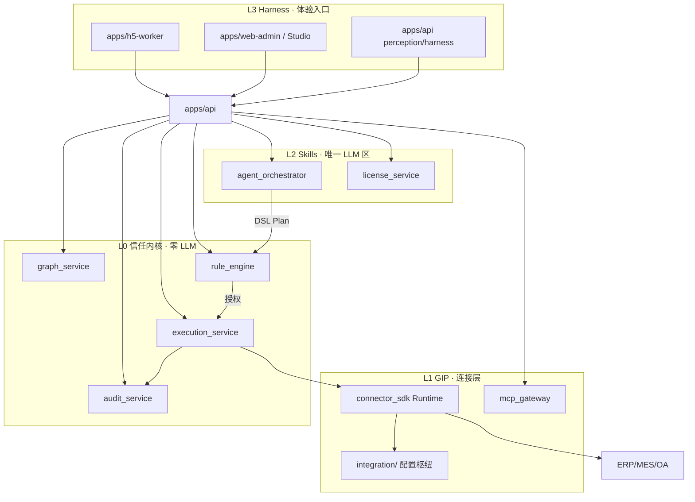

# FactoryOS 完整架构设计

> 版本：**v1.0.0** | 日期：2026-06-16  
> 状态：**Accepted**（W1 编码主入口）  
> 定位：在 ADR 000～007 与专项规格之上，给出 **可落地、可演进** 的完整架构总图  
> 读者：平台研发 · 集成实施 · 架构评审 · 新人 onboarding  

**权威层级**（冲突时）：

```text
ADR-000～007  >  本文  >  16/17  >  规格说明  >  OpenAPI + 15 Schema
```

**配套专题**（本文引用、不重复展开）：

| 专题 | 文档 |
|------|------|
| 基座能力详述 | [16-OS核心基座架构设计方案](../../准备/2026-06-16/16-OS核心基座架构设计方案.md) |
| 命名 | [命名约定](./命名约定.md) |
| 配置枢纽 | [配置枢纽与关系模型](./配置枢纽与关系模型.md) |
| 人审路径 | [人工决策 Playbook](../规格说明/人工决策Playbook.md) |
| 交互引导 | [factoryos-guide 规格](../规格说明/factoryos-guide规格.md)（**调试/过渡**） |
| Studio 主路径 | [UI-FIRST 产品宪法](../../.cursor/factoryos/UI-FIRST-CONFIG-PRINCIPLE.md) · [Integration-Studio 规格](../规格说明/Integration-Studio规格.md) |
| 公开 API | [os_core-public-api](./os_core-public-api.md) |
| 一致性台账 | [18-基座文档一致性矩阵](../../准备/2026-06-16/18-基座文档一致性矩阵.md) |

**实施主入口**：Integration Studio（`apps/web-admin`）— 见 [INTEGRATION-CHAIN](../../.cursor/factoryos/INTEGRATION-CHAIN.md)  
**平台研发调试**：`./scripts/factoryos guide`（非实施主路径）

---

## 1. 架构陈述（30 秒）

FactoryOS 是制造业 **AI 执行平台 Overlay**：在客户 ERP/MES 之上，用 **冻结 Graph + Rule + 唯一写路径 + Audit/Revert** 实现「敢写库、可追责、可回滚」；用 **Harness + 多模态** 实现工人愿意用。

**工程形态**：单 Git 仓库 · **Modular Monolith** · 单 deployable `apps/api` · 客户差异 **不进内核代码**。

**扩展形态**：GIP 配置枢纽 + Pack 飞轮 + **Integration Studio**（界面 + AI）实施主路径。

---

## 2. 设计原则（不可妥协）

| # | 原则 | 落地 |
|---|------|------|
| P1 | **写路径唯一** | Agent/MCP → DSL → Rule → Execution → Connector → Legacy |
| P2 | **内核少改** | `os_core/` tag `core-v1.0.0` 后集成期不改 major |
| P3 | **差异配置化** | `integration/` + Override；禁止 `if tenant_id` 内核分支 |
| P4 | **见名知意** | 目录/包/Pack ID 从名称读出职责 |
| P5 | **契约先行** | OpenAPI v1.1.1 + 15 JSON Schema + CMV |
| P6 | **人机分治** | 机器跑自动化；freeze/开写等人审走 Playbook |
| P7 | **可拆不换** | 模块边界 + CI fitness；**有痛点再拆** repo/进程 |
| P8 | **配置包迁出** | 迁出 = Git tenant 目录 + Package export，非幻想 0 成本微服务 |

---

## 3. 三平面架构（核心总图）

```text
┌──────────────────────────────────────────────────────────────────────────┐
│  Control Plane · 治理与契约（变更慢）                                        │
│  文档/ ADR · OpenAPI · JSON Schema · CMV · Playbook · flows.json          │
│  CI: import_boundaries · cmv_sync · openapi_schema_refs · contract tests   │
│  入口: Integration Studio（主）· factoryos guide（调试）· CODEOWNERS        │
└────────────────────────────────┬─────────────────────────────────────────┘
                                 │ 约束
┌────────────────────────────────▼─────────────────────────────────────────┐
│  Runtime Plane · 执行引擎（os_core + apps/api）                             │
│  L0 graph/rule/execution/audit │ L1 connector/mcp │ L2 agent/license      │
│  单进程 Modular Monolith · Uvicorn · PostgreSQL · Redis(预留) · OSS          │
└────────────────────────────────┬─────────────────────────────────────────┘
                                 │ 加载 / activate
┌────────────────────────────────▼─────────────────────────────────────────┐
│  Config Plane · 配置枢纽（变更快，GitOps）                                   │
│  integration/catalog · tenants/*/system_relations · packs · overrides      │
│  → connector_instances · tenant License · shadow_mode                     │
└────────────────────────────────┬─────────────────────────────────────────┘
                                 │ HTTPS / Edge WSS
┌────────────────────────────────▼─────────────────────────────────────────┐
│  External Plane · Legacy + 人机入口                                         │
│  ERP/MES/OA/IM · 钉钉 H5 · web-admin · Edge Agent（私网）                    │
└──────────────────────────────────────────────────────────────────────────┘
```

**灵活性来源**：

- **垂直扩展**：新 Pack / Blueprint / Graph 版本（Config Plane）  
- **水平扩展**：多 tenant · Cell · Pool/Bridge/Silo（ADR-007）  
- **入口扩展**：CLI / Studio / MCP / H5 共用同一 OpenAPI（Control Plane 契约）

---

## 4. 仓库物理架构

```text
FactoryOS/                              # 单 Git · uv workspace
├── os_core/                            # 内核（低频 · tag 冻结）
│   ├── shared_contracts/
│   ├── graph_service/
│   ├── rule_engine/
│   ├── execution_service/              # ★ 唯一写 Legacy
│   ├── audit_service/
│   ├── connector_sdk/                  # Blueprint Runtime + Registry
│   ├── agent_orchestrator/             # 唯一允许 LLM
│   ├── license_service/
│   └── mcp_gateway/
├── apps/
│   ├── api/                            # ★ 唯一生产 deployable
│   ├── web-admin/                      # Phase 1 后半
│   └── h5-worker/
├── integration/                        # ★ 配置枢纽（高频）
│   ├── catalog/                        # Layer A Definition
│   ├── packs/
│   ├── tenants/{id}/                   # Layer B/C + tenant.yaml
│   └── tools/
│       ├── connector-agent/
│       └── guide/flows.json            # factoryos guide 真源
├── 文档/                               # 契约与 ADR
├── tests/                              # AC-BASE-001 等
├── scripts/
│   ├── factoryos                       # ★ 接入/扩展引导 CLI
│   ├── check_import_boundaries.py
│   ├── check_cmv_sync.py
│   └── check_openapi_schema_refs.py
└── pyproject.toml
```

### 4.1 边界矩阵（谁可以 import 谁）

| 从 → 到 | os_core 私有 | os_core 公开 api | integration | apps/api |
|---------|-------------|------------------|-------------|----------|
| **integration/** | ❌ | ✅ 仅 connector_sdk·shared_contracts | ✅ | ❌ |
| **apps/api** | ✅ 各模块 api.py | ✅ | ❌ 不经由代码 | — |
| **os_core 模块间** | ❌ 跨私有 | ✅ 见膨胀期守则 §2 | ❌ | ❌ |

详表：[os_core-public-api](./os_core-public-api.md) · [膨胀期架构守则](./膨胀期架构守则.md)

### 4.2 低成本「迁出」语义

| 迁出单元 | 产物 | 代码改动 |
|----------|------|----------|
| 租户实施 | `integration/tenants/{id}/` + Package JSON | S1：**无** |
| 前端 | `apps/web-admin` 独立仓 + OpenAPI codegen | 可选 Phase 1 后半 |
| 内核 | 私有 PyPI 包 / 独立仓 | Gate 0' + 多团队时 |
| L0 四模块 | **不拆**（ADR-007） | — |

---

## 5. 平台逻辑分层（Platform-L0～L3）



| 层 | 模块 | 变更频率 | 扩展方式 |
|----|------|----------|----------|
| L0 | graph · rule · execution · audit | 极低 | ADR 修订 |
| L1 | connector_sdk · mcp_gateway · integration | 高 | Blueprint / Pack |
| L2 | agent · license | 中 | Skill Pack |
| L3 | api 路由 · 前端 | 中 | Harness / Studio |

---

## 6. 唯一写路径（运行时铁律）

```text
感知/IM/H5
    → agent_orchestrator（LangGraph → DSL Plan JSON）
    → rule_engine.evaluate（默认 deny）
    → execution_service.execute（Saga · idempotency · shadow）
    → connector_sdk.write（httpx · Blueprint Runtime）
    → Legacy ERP/MES
    ↔ audit_service.append（全程）
    ↔ revert / compensator（WORK_REPORT_REVERT 等）
```

| 红线 | ADR |
|------|-----|
| Agent 直写 Legacy | R-01 ❌ |
| 非 frozen Graph 执行 L2 写 | R-03 ❌ |
| MCP 直调 connector.write | ADR-004 ❌ |
| integration import execution 私有 | os_core-public-api ❌ |

---

## 7. 配置枢纽与数据真源分工

| 关心的事 | 真源 | 不要重复在 |
|----------|------|------------|
| 厂商 HTTP 怎么调 | `catalog/blueprint.yaml` | Graph |
| 租户连哪个 ERP | `tenants/.../system_relations/` | 内核 Python |
| 业务谁先谁后 | frozen Graph | relation YAML |
| 厂规阈值 | OverrideDocument | execution 代码 |
| 运行时绑定 | `connector_instances` 表 | 仅 DB 无 Git |
| 实施快照 | ImplementationPackage | — |

**合并优先级**：

```text
Scope Override > Tenant Override > mapping_overrides > catalog/mapping > Pack 默认
```

详：[配置枢纽与关系模型](./配置枢纽与关系模型.md)

---

## 8. 扩展模型（灵活度核心）

### 8.1 三速接入（GIP）

| 模式 | 周期 | 改什么 | 适用 |
|------|------|--------|------|
| **S1** | ≤1 周 | import Package + tenant 配置 | 第二家起 · Silver Pack |
| **S2** | ≤2 周 | catalog Blueprint + 人审 | 新 vendor · 80% YAML |
| **S3** | 1～2 周 | Python Connector + meta blueprint | 复杂协议 20% |

**共同 Gate**：Shadow → Contract Test → 对账 → **G-WRITE-APPROVE** → 开写。

### 8.2 双写入路径（ADR-005）

| Path | 场景 | 写 Pack |
|------|------|---------|
| **A** | 有 ERP 无 MES（哈森灯塔） | `conn-erp-{vendor}-write` |
| **B** | MES 写 + ERP 读 | `conn-mes-{vendor}` |
| **C** | B-Lite 无 ERP | `conn-mes-builtin` |

### 8.3 D1 / D2 与 Pack 飞轮

```text
部署 → 工作坊 freeze → export Package → Pack 库
    → 下一家 import（S1）→ 周期缩短
D2 定制 ≥70% Pack 化（ADR-003）
```

---

## 9. 人机协同运维架构

```text
                    ┌─────────────────────┐
                    │ Integration Studio  │  实施/客户 · 对外主路径
                    │  flows.json 真源    │
                    └──────────┬──────────┘
                               │
         ┌─────────────────────┼─────────────────────┐
         ▼                     ▼                     ▼
  factoryos guide（调试）  Playbook Gate          运维 Runbook
  平台研发/CI 文档生成      人审红线清单           drift/revert/circuit
         │                     │                     │
         └─────────────────────┴─────────────────────┘
                               │
                         apps/api OpenAPI
                               │
                         Audit 全链路留痕
```

| 能力 | 自动化 | 必须人工 |
|------|--------|----------|
| connect / discover | ✅ | — |
| mapping AI 建议 | ⚠️ | 人确认 |
| Graph freeze | ❌ | business_owner 签字 |
| Shadow 14d | ⚠️ | 对账解释 |
| 开写 | ❌ | admin + 业务双签 |
| Bronze→Silver | ❌ | platform 人审 |

实施入口：**Integration Studio**（`apps/web-admin`）  
平台调试：`./scripts/factoryos guide` · `./scripts/factoryos guide map onboard`

---

## 10. 数据架构摘要

| 层 | 存储 | 内容 |
|----|------|------|
| Data-L0 | Legacy | 客户权威账本 |
| Data-L1 | PostgreSQL 16 | Graph · Rule · ExecutionRecord · Audit |
| Data-L2 | OSS | 语音/图片 30d TTL |
| Data-L3 | 选配数仓 | **非** Overlay 默认 |

**W1 规模预埋表**（ADR-007）：`tenants.cell_id` · `placement_tier` · `connector_instances` · `outbox_events` · `tenant_quotas`

**多租户**：全表 `tenant_id`；middleware 顺序 Auth → tenant → Quota → Rule → Execution

详：[数据架构图说明](./数据架构图说明.md)

---

## 11. 部署拓扑

### 11.1 Y1 单厂 / 单 Cell（Baseline）

```text
SLB → Nginx → Uvicorn×N (apps/api) → RDS PG16
                              ├→ Redis/Tair（预留）
                              ├→ OSS
                              └→ Edge Agent（私网 ERP，出站 WSS）
```

### 11.2 规模档位（ADR-007）

| 档位 | 形态 | 适用 |
|------|------|------|
| **Pool** | 共享 App + 共享 RDS + RLS | Standard |
| **Bridge** | 共享 App + 独立 schema | 合规 mid-market |
| **Silo** | 独立 ECS+RDS+Redis 栈 | Enterprise |

**禁止 Phase 1**：Kafka 集群 · K8s 多集群 · L0 拆微服务

详：[10-阿里云基础设施定版方案](../../准备/2026-06-16/10-阿里云基础设施定版方案.md)

---

## 12. 技术栈（锁定）

| 类别 | 选型 |
|------|------|
| 语言 | Python 3.12+（服务端）· React 18 + TS（前端后半） |
| API | FastAPI · OpenAPI 3.1 · Uvicorn |
| DB | PostgreSQL 16 · SQLAlchemy 2 async · Alembic |
| Connector | httpx async · Blueprint Runtime |
| AI | LangGraph + LiteLLM（仅 agent_orchestrator） |
| 校验 | Pydantic v2 + jsonschema |
| 队列 S1+ | Redis Streams · Outbox Worker |
| 包管理 | uv workspace |
| 测试 | pytest · pytest-asyncio · httpx ASGI |

---

## 13. CI / 质量门禁（Fitness Functions）

| 检查 | 脚本 | 触发 |
|------|------|------|
| os_core  import 边界 | `check_import_boundaries.py` | `os_core/**` 变更 |
| CMV 与 Schema 同步 | `check_cmv_sync.py` | Schema/CMV 变更 |
| OpenAPI $ref | `check_openapi_schema_refs.py` | 接口变更 |
| AC-BASE-001 P0（52） | `pytest tests/` | `os_core/**` |
| Pack contract | `pytest tests/contract/` | `integration/**` |
| 无明文密钥 | grep CI | `integration/tenants/**` |

**Gate 0**：52 P0 全 PASS → tag `core-v1.0.0`  
**Gate 0'**：frozen Graph + 真实 ERP 样例 + Shadow ≥14d

---

## 14. 安全与治理摘要

| 域 | 机制 |
|----|------|
| 授权 | Pack License 硬拒绝 403 |
| 写 | Rule 默认 deny · shadow_mode 默认 true |
| 审计 | append-only · ExecutionEvidence |
| 凭证 | secrets_ref · Vault/Edge · 不进 Git |
| 私网 | Edge Agent 出站 mTLS/WSS |
| MCP | tools/call → DslPlan only |
| Evolution | EVO-X01～X07 禁止自动 freeze/开写 |

详：ADR-002 · [Evolution-Layer-宪章](./Evolution-Layer-宪章.md)

---

## 15. 演进路线（何时变架构）

| 信号 | 动作 | 不改什么 |
|------|------|----------|
| W1–W8 | 搭 os_core + api + integration 骨架 | 写路径 |
| Gate 0' 灯塔 | 哈森 Path A 真实集成 | L0 四模块 |
| 第二家 S1 | import + tenant 配置枢纽 | 内核 |
| ≥50 tenant | 第二 Cell · Outbox 独立进程 | L0 |
| 多团队消费内核 | 私有 PyPI / 内核独立仓 | 公开 API 契约 |
| Phase 3+ | GIP/Quota 可选拆进程 | execution 唯一写 |

**拆 repo 检查清单**（全满足再拆）：

1. `os_core-public-api` semver 稳定 ≥2 个 minor  
2. 独立团队与独立发布周期  
3. 契约 CI 跨仓仍绿  
4. 新 ADR Accepted  

---

## 16. W1–W8 落地清单（可执行）

| 周 | 交付 | 验收 |
|----|------|------|
| W1 | uv workspace · os_core/shared_contracts · Alembic S-01～S04 · mock connector · `integration/tenants/_template` | import_boundaries OK |
| W2 | audit_service · execution shadow/idempotency | AC 子集 |
| W3 | graph freeze · rule evaluate | AC Graph/Rule |
| W4 | connector_sdk/runtime · catalog 样例 | contract test |
| W5 | agent stub · harness confirm | AC UX stub |
| W6 | integration 灯塔 tenant 草案 · license stub | Pack loader |
| W7 | mcp_gateway stub | M-01/M-02 |
| W8 | **52 P0 全 PASS** | tag **core-v1.0.0** |

**并行**：Studio v0（Tenant/Connect/Gate 状态，可先 mock）；`factoryos guide` 供平台调试 flows；API 就绪后 Studio 接真数据。

---

## 17. 架构图索引

| 图 | 说明 |
|----|------|
| [基座能力说明图](./基座能力说明图.png) | 非技术 + 技术双受众总览 |
| [系统架构图](./系统架构图.png) | 平台分层 · Path A/B/C |
| [技术架构图](./技术架构图.png) | 技术栈 · 云部署 |
| [数据架构图](./数据架构图.png) | Data-L0～L3 |
| [核心模块架构图](./核心模块架构图.png) | os_core 依赖矩阵 |

---

## 18. 架构评审自检（Definition of Done）

- [ ] 所有 Legacy 写经 `execution_service`  
- [ ] 客户差异仅在 `integration/` + Override  
- [ ] 实施顾问在 Studio 内 30 分钟内可理解 onboard 全流程（或演示环境）  
- [ ] tenant 配置以 PostgreSQL 为主；Git YAML 为 export/import 快照  
- [ ] freeze / 开写有 Playbook Gate，guide 标 👤  
- [ ] CI 边界脚本全绿  
- [ ] 与 18 矩阵无 P0 漂移  

---

## 19. 版本历史

| 版本 | 日期 | 变更 |
|------|------|------|
| **v1.0.0** | 2026-06-16 | 初版：三平面 · 配置枢纽 · guide · W1–W8 · 与 ADR 000～007 对齐 |

---

## 附录 A · 模块依赖（os_core）

```text
shared_contracts
    ↑
audit_service ← graph_service ← rule_engine
                    ↑              ↑
              execution_service ───┘
                    ↑
              connector_sdk
agent_orchestrator → (仅 DSL 计划，无写)
license_service
mcp_gateway → agent 公开面
```

## 附录 B · OpenAPI 域划分（apps/api）

| 域前缀 | 责任模块 |
|--------|----------|
| `/v1/graphs` | graph_service |
| `/v1/rulesets` | rule_engine |
| `/v1/executions` | execution_service |
| `/v1/audit` | audit_service |
| `/v1/integration` | connector_sdk + Studio |
| `/v1/packages` | license + graph export/import |
| `/v1/harness` · `/v1/perception` | api 路由 + agent |
| `/v1/mcp` | mcp_gateway |

契约真源：[工厂操作系统-v1.1.yaml](../接口/工厂操作系统-v1.1.yaml)
