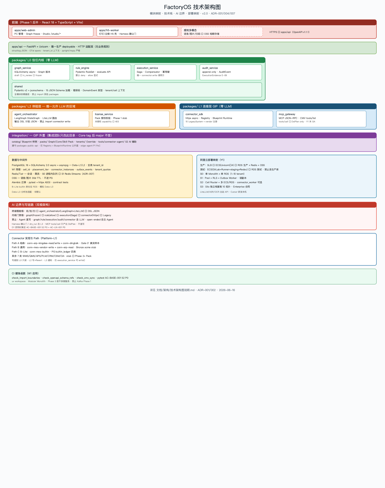

# 技术架构图说明

> 版本：**v2.0.0** | 日期：2026-06-16  
> 依据：[架构决策记录 001](./架构决策记录-001-系统架构总览.md)、[系统架构图说明](./系统架构图说明.md)、ADR-004/007



> 配图 **v2.0** 已与 Path A 灯塔、9 个 os_core 模块、`integration/`、ADR-007 规模预埋对齐。

---

## 一、与系统架构图的对应关系

| 系统架构图层 | 技术实现 |
|--------------|----------|
| Platform-L3 Harness | `src/apps/web-admin` · `src/apps/h5-worker` → `server/api`（FastAPI） |
| Platform-L2 Skills | `agent_orchestrator`（LangGraph + LiteLLM）+ `license_service` |
| Platform-L0 信任内核 | `graph_service` · `rule_engine` · `execution_service` · `audit_service` |
| Platform-L1 Connector + GIP | `connector_sdk` + Blueprint Runtime + Registry + `mcp_gateway` |
| GIP 外置 | `integration/catalog` · `packs` · `tenants` · `tools/connector-agent` |
| Data-L0 账本 | 客户 ERP/MES 或 builtin PG 表 |
| Data-L1 运行数据 | PostgreSQL 16（SQLAlchemy 2.0 async） |

---

## 二、AI 板块边界（必读）

### 2.1 唯一使用 LLM 的位置

```text
os_core/agent_orchestrator/
  ├── LangGraph StateGraph    # Skill FSM（如 work_report_v1）
  ├── LiteLLM                 # 模型路由
  └── Pydantic 结构化输出     # DSL 计划 JSON
```

### 2.2 AI 可以做什么

| 能力 | 说明 |
|------|------|
| 意图理解 | 自然语言 → 识别 Skill |
| 填槽 | 提取工单号、数量等参数 |
| 生成 DSL 计划 | 符合 Schema 的 `DSLAction` 列表 |
| 多轮澄清 | LangGraph 图内追问 |

### 2.3 AI 禁止做什么（红线 ADR-002）

| 禁止 | 后果 |
|------|------|
| 直写 ERP/MES | R-01 |
| 调用 `connector_sdk.write` | 绕过 Execution |
| 自动 freeze Graph | 须人工/API 显式 |
| L0/L1 模块含 LLM | 架构违规 |
| open-ended 自主 Agent | 必须固定 FSM |

### 2.4 写操作完整链路

```text
用户 → H5/Web → FastAPI /v1/agent/*
  → LangGraph（LLM）→ DSL JSON
    → rule_engine（无 LLM）
      → execution_service（无 LLM）
        → connector_sdk（httpx）
          → audit_service
```

### 2.5 双极架构

```text
终端智能极（L2/L3）          内核门禁极（L0）
  说/拍/扫/点                    Graph frozen
       ↓                         Rule allow
  agent_orchestrator              Execution 唯一写
       ↓                         Audit + Revert
  Harness 确认门 ────────────────┘
```

---

## 三、技术栈速查

| 类别 | 选型 |
|------|------|
| 后端 | Python 3.12+ · FastAPI · Uvicorn |
| 包管理 | uv workspace |
| 数据库 | PostgreSQL 16 · SQLAlchemy 2.0 async · asyncpg · Alembic |
| Legacy 调用 | httpx async |
| AI | LangGraph · LiteLLM（仅 agent_orchestrator） |
| MCP | `mcp_gateway` · CMV v1.1.0 · MCP 2026-07 |
| 契约 | Pydantic v2 + 15 JSON Schema · OpenAPI v1.1.1 |
| 前端 | React 18 + TypeScript + Vite |
| 消息（S1+） | Redis Streams + Outbox Worker（ADR-007） |
| 可观测 | structlog + OpenTelemetry |

---

## 四、Connector 与 Path（Platform-L1）

| 路径 | 实现 | 阶段 |
|------|------|------|
| Path A 哈森 | `conn-erp-kingdee-read/write` + `conn-dingtalk` | Gate 0' |
| Path B 通用 | `conn-mes-{vendor}-write` + `conn-erp-read` | MVP-001 |
| Path C B-Lite | `conn-mes-builtin` + builtin_ledger 表 | 预埋 |
| 其余 7 类 | stub Pack | Phase 2+ |

**写权限**：仅 `execution_service` → `connector_sdk.write`。

---

## 五、部署与规模（技术视角）

| 阶梯 | 技术形态 |
|------|----------|
| **S0** | 单 Monolith + 单 RDS（1–10 tenant） |
| **S1** | Pool + RLS + Outbox + Redis Streams |
| **S2** | Cell Router + `connector_instances` + 多 ECS/RDS |
| **S3** | Silo 独立栈 · Enterprise |

W1 预埋：`tenants.cell_id`、`placement_tier`、`outbox_events`、`tenant_quotas`、`connector_instances`。

详见 [10-阿里云基础设施](../../准备/2026-06-16/10-阿里云基础设施定版方案.md)、[ADR-007](./架构决策记录-007-百级千级演进策略.md)。

---

## 六、CI 健身函数（W1）

| 脚本 | 门禁 |
|------|------|
| `check_import_boundaries.py` | 模块依赖矩阵 |
| `check_openapi_schema_refs.py` | OpenAPI $ref |
| `check_cmv_sync.py` | CMV 同步 |
| `pytest` AC-BASE-001 | **52 P0** |

---

## 七、参考

- [核心模块架构图](./核心模块架构图说明.md)
- [数据架构图](./数据架构图说明.md)
- [膨胀期架构守则](./膨胀期架构守则.md)
- [os_core-public-api](./os_core-public-api.md)

---

## 版本历史

| 版本 | 日期 | 变更 |
|------|------|------|
| v1.0.0 | 2026-06-16 | 初版 |
| v1.1.0 | 2026-06-16 | 哈森双路径勘误 |
| **v2.0.0** | 2026-06-16 | **PNG v2**：9 个 os_core 模块 · integration/ · MCP · ADR-007 · CI · OSS |
