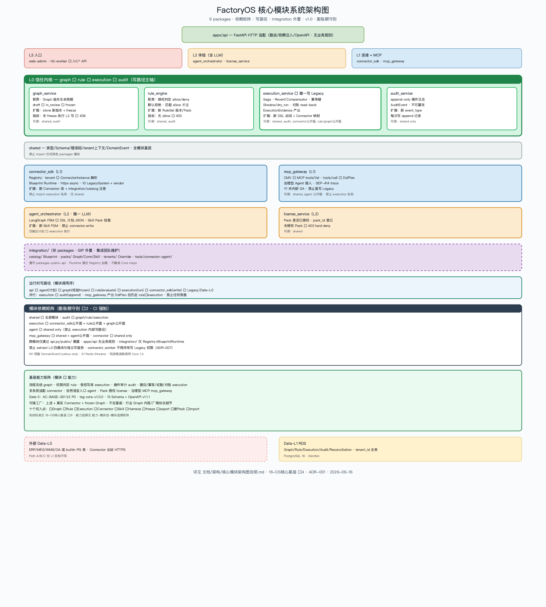

# 核心模块系统架构图

> 版本：**v1.0.0** | 日期：2026-06-16  
> 依据：[16-OS核心基座架构设计方案](../../准备/2026-06-16/16-OS核心基座架构设计方案.md) §4 · [膨胀期架构守则](./膨胀期架构守则.md) §2 · ADR-001



---

## 一、模块总览（9 个 os_core 模块 + integration）

| 模块 | 平台层 | 职责 | LLM |
|------|--------|------|-----|
| `shared_contracts` | 基底 | Schema、错误码、tenant/cell 上下文 | 否 |
| `graph_service` | L0 | Graph 版本与 freeze | 否 |
| `rule_engine` | L0 | allow/deny 授权 | 否 |
| `execution_service` | L0 | **唯一写 Legacy**；Revert/对账/幂等 | 否 |
| `audit_service` | L0 | append-only 审计 | 否 |
| `connector_sdk` | L1 | Registry + Blueprint Runtime + httpx | 否 |
| `mcp_gateway` | L1 | MCP → DslPlan | 否 |
| `agent_orchestrator` | L2 | LangGraph → DSL 计划 | **是** |
| `license_service` | L2 | Pack 授权 | 否 |
| `integration/` | GIP 外置 | catalog · packs · tenants | 否 |

`apps/api` 为 HTTP 适配层，**不含业务规则**。

---

## 二、写路径调用序

```text
apps/api
  → agent_orchestrator（产出 DSL 计划）
  → graph_service（必须 frozen）
  → rule_engine（evaluate allow/deny）
  → execution_service（Saga 执行）
  → connector_sdk.write（httpx → Legacy）
  → audit_service.append（并行）
```

**红线**：`agent_orchestrator`、`mcp_gateway` **不得** 调用 `connector_sdk.write` 或绕过 `execution_service`。

---

## 三、依赖矩阵（CI 强制）

| 模块 | 可调 | 禁止直接 import |
|------|------|-----------------|
| `shared_contracts` | — | 任何 os_core 模块 |
| `audit_service` | `shared_contracts` | 其他业务模块 |
| `graph_service` | `shared_contracts`, `audit_service` | execution/connector 私有 |
| `rule_engine` | `shared_contracts`, `audit_service` | execution/graph 私有 |
| `execution_service` | `shared_contracts`, `audit`, connector/rule/graph **公开面** | agent 私有 |
| `connector_sdk` | `shared_contracts` | execution 私有 |
| `agent_orchestrator` | `shared_contracts` | execution 内部写路径 |
| `license_service` | `shared_contracts` | — |
| `mcp_gateway` | `shared_contracts`, agent **公开面** | execution 私有 |

跨模块仅通过 `api.py` / `public/` 暴露符号。详见 [膨胀期架构守则](./膨胀期架构守则.md)。

---

## 四、扩展方式（不改 L0 代码路径）

| 扩展什么 | 怎么做 | 改内核？ |
|----------|--------|----------|
| 新厂商系统 | Connector Pack + Registry | 否 |
| 新业务流程 | Graph clone 新版本 + freeze | 否 |
| 新办事场景 | Skill Pack 挂载 agent | 否 |
| 新 DSL 动词 | CMV 注册表 + Connector 映射 | 否（只增注册） |
| 第二家工厂 | Implementation Package import | 否 |
| 百级千级 | cell_id / outbox / quotas 预埋（ADR-007） | 否（schema only @W1） |

---

## 五、与其他架构图关系

| 图 | 侧重点 |
|----|--------|
| **核心模块架构图**（本图） | os_core 模块职责、依赖、写路径调用序 |
| [系统架构图](./系统架构图说明.md) | 平台分层、Pack 扩展、Path A/B/C |
| [技术架构图](./技术架构图说明.md) | 技术栈、AI 边界、云部署 |
| [数据架构图](./数据架构图说明.md) | Data-L0～L3、写操作数据落点 |
| [基座能力说明图](./基座能力说明图.png) | 非技术/技术双受众总览 A～J |

---

## 版本历史

| 版本 | 日期 | 变更 |
|------|------|------|
| v1.0.0 | 2026-06-16 | 初版：9 个 os_core 模块 · 依赖矩阵 · 与 16/膨胀期守则对齐 |
