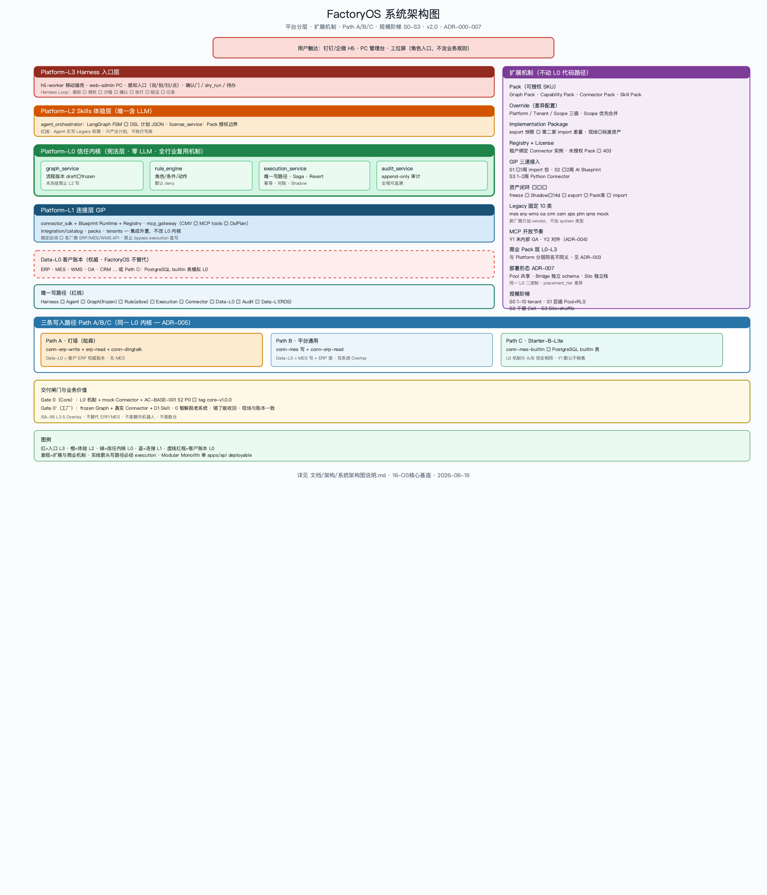

# 系统架构图

> 版本：**v2.0.0** | 日期：2026-06-16  
> 依据：ADR-000～007 · CAPABILITY-PACK-MAP · `16-OS核心基座` · `连接器` §3.0



> 配图与本文 **v2.0 同步**：Path A 灯塔（哈森 ERP+钉钉）已标为首选灯塔路径；通用 MES 厂为 Path B。

---

## 图例说明

### 1. 系统结构（自上而下）

| 层 | 名称 | 核心组件 | 职责 |
|----|------|----------|------|
| **入口层** | Platform-L3 Harness | 钉钉/企微 H5、PC Web、工位屏 | 角色触达；感知多模态；不含业务逻辑 |
| **体验层** | Platform-L2 Skills | `agent_orchestrator`、`license_service` | 意图→DSL 计划；**无写 Legacy 权限** |
| **信任内核** | Platform-L0 | Graph、Rule、Execution、Audit | 全行业复用机制；**宪法层**；零 LLM |
| **连接层** | Platform-L1 GIP | `connector_sdk`、Blueprint、Registry、`mcp_gateway` | 稳定动词→Legacy；`integration/` 外置 |
| **账本层** | Data-L0 | ERP、MES、WMS、OA… 或 builtin 表 | 客户权威源；OS **不替代** |

**唯一写路径**（红线）：

```text
Harness → Agent → Graph(frozen) → Rule(allow) → Execution → Connector → Data-L0 → Audit → Data-L1
```

### 2. 系统分部（部署）

```text
server/api          HTTP 入口（Modular Monolith 单 deployable）
os_core/         9 模块：graph · rule · execution · audit · connector · agent · license · mcp_gateway · shared_contracts
integration/      GIP：catalog · packs · tenants（不改 Core）
PostgreSQL        Data-L1 运行数据 + tenant_id 全表
Legacy 系统       客户侧 ERP/MES，FactoryOS Overlay 对接
```

Phase 1：**单实例 Monolith**（S0）；S1 起 Pool+RLS；S2 Cell 路由（ADR-007）。

### 3. 扩展性

| 机制 | 扩展什么 | 演进 |
|------|----------|------|
| **Pack**（Graph/Capability/Connector/Skill） | 新场景、新系统、新能力 | D1 沉淀 → Pack 库 → S1 import |
| **Override**（Platform/Tenant/Scope） | 厂/线/设备差异 | Y2 起；禁止改内核 |
| **Implementation Package** | 第二家工厂复制 | export/import 差量 |
| **Registry** | 10 类 Legacy + vendor | Path A/B/C 组合不同 |
| **MCP 开放** | 治理型 Agent | Y1 末内部 GA；Y2 对外（ADR-004） |
| **部署三态** | Pool / Bridge / Silo | ADR-007；同一 L0 二进制 |

### 4. 双切入路径（ADR-005）

| 路径 | 典型客户 | Connector 组合 | 写路径落点 |
|------|----------|----------------|------------|
| **A · 灯塔（哈森）** | 有 ERP + 钉钉，无 MES | `conn-erp-*` 读+写 + `conn-dingtalk` | **客户 ERP** |
| **B · 通用 MES 厂** | 有 MES + ERP | `conn-mes-*` 写 + `conn-erp-*` 读 | **MES** |
| **C · B-Lite** | 无 ERP/MES | `conn-mes-builtin` | **RDS builtin 表** |

**Platform-L0 与 Pack 机制三条线完全相同**；仅 Registry 注册的 Pack 不同。

### 5. 业务价值

| 价值 | 平台机制 |
|------|----------|
| **0 智解脱老系统** | 感知多模态 + Harness 确认 |
| 打掉执行断层 | Overlay + frozen Graph 跨系统编排 |
| AI 敢写库 | DSL + Rule；Agent 无直写权 |
| 错了能收回 | Audit + Revert + Compensator |
| 现场与账本一致 | Shadow≥14d + 对账 Job |
| 第二家更快 | Implementation Package 复制 |
| 百级可演进 | ADR-007 S0→S3；W1 预埋 cell/outbox |

### 6. 必要性（为何这样建）

| 问题 | 若不建 OS | FactoryOS 解法 |
|------|-----------|----------------|
| 系统孤岛 | 人肉搬数据 | Connector Pack + Graph |
| 试点地狱 | 无限 POC | D1 五项 + ≤90 天结案 |
| 定制腐蚀 | Whale Tax | Override + Pack；内核不变 |
| 商业脱节 | 卖项目 | Pack-L0–L3 与模块 1:1 |
| 换 ERP 风险 | 巨大迁移 | Overlay 不动账本 |

---

## 与交付模型关系

```text
Gate 0  （底座）     →  L0 机制 + mock Connector + 52 P0 → core-v1.0.0
Gate 0' （工厂）     →  frozen Graph + 真实 Connector（Path A/B）+ D1 Skill
D1 通病包           →  L1 Pack 组合（见 CAPABILITY-PACK-MAP §2）
D2 扩展包           →  L2/L3 Pack + Override
```

---

## 架构图族

| 图 | 回答什么 |
|----|----------|
| **系统架构图**（本图） | 平台分层、扩展、Path A/B/C、规模 |
| [技术架构图](./技术架构图说明.md) | Python 模块、AI 边界、云映射 |
| [数据架构图](./数据架构图说明.md) | 数据放哪、流到哪 |
| [核心模块架构图](./核心模块架构图说明.md) | 9 个 os_core 模块 职责与依赖 |
| [基座能力说明图](./基座能力说明图.png) | 非技术/技术双受众总览 |

---

## 参考

- [ADR-000 摘要](./架构决策记录-000-闸门零决策摘要.md)
- [ADR-005 双路径](./架构决策记录-005-双写入路径与灯塔定版.md)
- [ADR-007 规模](./架构决策记录-007-百级千级演进策略.md)
- [CAPABILITY-PACK-MAP](./能力-模块包-模块追溯矩阵.md)
- [16-OS核心基座](../../准备/2026-06-16/16-OS核心基座架构设计方案.md)

---

## 版本历史

| 版本 | 日期 | 变更 |
|------|------|------|
| v1.0.0 | 2026-06-16 | 初版 |
| v1.1.0 | 2026-06-16 | 双切入路径勘误 |
| **v2.0.0** | 2026-06-16 | **PNG v2 重生成**：GIP/integration · ADR-007 · 9 个 os_core 模块 · MCP 节奏 · 资产闭环 |
