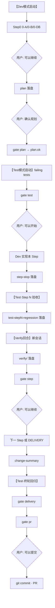

# 开发前全链路 · PRE-DEV-CHAIN

> **目的**：W1 开工前一次性看清「从拉仓到 PR」的每一环、每一类可变更线索、谁维护、怎么验。  
> **原则**：完善 · 可观测 · 可追踪 · 低智管理（能机械就不靠记忆）。  
> **双轨**：本文件 = **平台研发轨**；接入/扩展见 [INTEGRATION-CHAIN](./INTEGRATION-CHAIN.md) · [UI-FIRST-CONFIG-PRINCIPLE](./UI-FIRST-CONFIG-PRINCIPLE.md)。

---

## 〇、双轨（产品核心不变 · 表现形态分轨）

| 轨 | 对象 | 主路径 | 文档 |
|----|------|--------|------|
| **研发轨** | 平台团队写内核/Studio/API | SH-步步流 · gate · hooks | 本文 §二起 |
| **配置轨** | 实施/客户接入与扩展 | **管理台 UI + AI**（非 CLI/改仓库） | [UI-FIRST](./UI-FIRST-CONFIG-PRINCIPLE.md) |

```text
产品核心（不变）     Graph · Rule · 写路径 · Audit · Pack
对外表现（已转向）   Integration Studio 界面操作 · 人审落库可回溯
平台内部（仍需要）   SH-步步流 · guide 调试 · 契约测试
```

---

## 一、真源分层（改东西前先对号入座）

```text
L0 机器契约     contracts/              CI · pytest · OpenAPI · Schema · AC
L1 工作流执行   .cursor/factoryos/      关键词 · Gate · 模板 · 红线摘要
L2 Agent 加载   .cursor/rules/*.mdc     alwaysApply / 口令触发
L3 机械闸门     scripts/ + hooks/       gate · harness · docs_baseline · protect-paths
L4 运行时证据   _factoryos_pipeline/    plan · test · step-stop · verify · summary
L5 认知基线     .cursor/docs-baseline/  docs 漂移检测（非执行真源）
L6 厚文档       docs/                   ADR 长文 · 准备材料（可选外迁）
```

**禁止双改**：契约只改 `contracts/`；`docs/文档/数据结构` 与 `docs/接口` 已 superseded，见 docs-baseline Tier-C。

---

## 二、开发前一次性清单（复制打勾）

| # | 动作 | 命令 / 路径 | 验证 |
|---|------|-------------|------|
| 1 | **激活开发环境** | `./scripts/activate_dev_env.sh`（见 [README §激活](../../README.md#激活开发环境)） | `gate pr` 绿 · `.git/hooks/pre-commit` |
| 2 | Cursor Hooks | 打开仓库根 · Settings → Hooks · **重启** | `protect-paths` 可见 · 未授权写码被拦 |
| 3 | workflow_state | `_factoryos_pipeline/workflow_state.md` | `phase: STEP0`（新轮迭代正常） |
| 4 | 读索引 | [INDEX.md](./INDEX.md) · [ACTIVATION.md](./ACTIVATION.md) | — |

详表：[ACTIVATION.md](./ACTIVATION.md)

---

## 三、单轮研发链路（Dev · Test · Verify）



### 关键词 → state → 允许写入

| 关键词 | workflow_state | 允许 |
|--------|----------------|------|
| （初始） | `STEP0` | pipeline · contracts · scripts · .cursor · docs |
| `可以继续`（Step0 后） | `PLANNING` | + plan/ |
| `确认规划` | `CAN_TEST` + plan.ok | + test/ · src/tests/ |
| `可以开始` | `CAN_CODE` | + src/os_core · apps · integration 业务码 |
| Step 验收 `可以继续` | 下一 Step | 保持 CAN_CODE |
| 全部 Step 完成 | `DELIVERY` | summary · 终轮 Test |
| `可以提交` | `DELIVERY` | git commit · push · PR（须 gate delivery 绿） |

真源：`_factoryos_pipeline/workflow_state.md` · [GATES.md](./GATES.md)

### 三 Agent 口令

| Agent | 口令 | 细则 |
|-------|------|------|
| Dev | `【Dev模式启动】` + 目标 | [STEP0](./STEP0.md) · [DEV-GATES](./DEV-GATES.md) |
| Test | `【Test模式启动】` · `【Test·Step N 验收】` · `【Test·终轮回归】` | [TEST-GATES](./TEST-GATES.md) |
| Verify | `【Verify回合】Step N`（**新对话**） | [VERIFY-GATES](./VERIFY-GATES.md) |

**里程碑附加口令**（非 SH-步步流通用）：plan / [编码绝对门禁](../rules/编码绝对门禁.mdc) 可约定首轮业务码总闸。当前 W1：`确认编码门禁，开始 W1`（在 `可以开始` 之前）。

---

## 四、机械门禁层（L3 · 可观测）

| 节点 | 命令 | 观测输出 |
|------|------|----------|
| 确认规划 | `./scripts/gate plan` | `.gates/plan.ok` |
| test-plan | `./scripts/gate test` | stdout PASS |
| 编码中 | `./scripts/harness --tier auto` | 四门子集 |
| Step 停机 | `./scripts/gate step --step N -k 'AC'` | harness+pytest+Test落盘+verify+static |
| commit 前 | `./scripts/gate delivery` | 终轮回归 pytest 全量 + final-regression 落盘 |
| PR | `./scripts/gate pr` | CI 同款 |
| docs 漂移 | `./scripts/gate docs-sync` | Tier-A/C fail · B warn |
| Gate 0 | `./scripts/gate gate0` | 52 P0 预备 |

CI：`.github/workflows/ci.yml` · PR body：[pull_request_template.md](../../.github/pull_request_template.md)

---

## 五、落盘与可追踪（L4）

```text
_factoryos_pipeline/
  workflow_state.md
  .gates/plan.ok
  <YYYY-MM-DD>/
    plan/ · test/ · step-stop/ · verify/ · summary/ · bug/
    test/test-*-stepN-regression.md    # 每 Step 强制
    test/test-*-final-regression.md    # commit 前强制
```

| 工件 | 模板 | 追溯用途 |
|------|------|----------|
| plan | `.cursor/factoryos/templates/plan-template.md` | PR body 必填路径 · AC 对账 |
| test | `test-template.md` | Test Gate A–G · 编码前 |
| test-step | `test-step-regression-template.md` | **每 Step 硬性验收** |
| test-final | `test-final-regression-template.md` | **终轮回归 · commit 前** |
| step-stop | `step-stop-template.md` | Step 十项自检 |
| verify | `verify-template.md` | 独立审阅 · gate step 前置 |
| summary | `change-summary-template.md` | PR 摘要 |

**聊天不能代替落盘。** 模板同步：`_factoryos_pipeline/_templates/` ≡ `.cursor/factoryos/templates/`

---

## 六、维护地图（变更线索 → 必做动作）

> 低智管理：**改左列 → 跑中列 → 必要时改右列**。

| 你改了什么 | 必跑 / 必做 | 可能还要更新 |
|------------|-------------|--------------|
| `contracts/openapi` | `harness --tier contracts` · contract pytest | plan 模板 AC 表 · `src/tests/contract/` |
| `contracts/schemas` | 同上 | Pydantic `shared_contracts`（W1+） |
| `contracts/cmv` | `check_cmv_sync` | DSL 规格 · execution 测试 |
| `contracts/acceptance` | AC registry · pytest `-k` | `.cursor/factoryos/AC-P0-INDEX.md` |
| `src/os_core/**` | `harness --tier boundaries` 或 `auto` | MODULE-MAP · import 矩阵 |
| `src/apps/**` 业务 | `harness --tier step` | apps README · API 契约 |
| `src/integration/**` | boundaries + pack contract tests | `integration/catalog/` |
| `src/tests/**` | `pytest` · `gate test/step` | test-plan 落盘 |
| `.cursor/factoryos/**` | 人工审 · 无自动 gate | INDEX · README 链 |
| `docs/` Tier-A（ADR·验收·门禁） | `docs_baseline refresh` · `workflow-check` | `.cursor/factoryos/` 映射项 |
| `docs/` Tier-B | `docs_baseline refresh`（推荐） | — |
| `docs/` Tier-C | `contracts-crosscheck` 若改了文件 | **只改 contracts/** 为真源 |
| `scripts/` 新门禁 | 注册 `check_harness.py` + `ci.yml` + README | HARNESS-SCRIPTS.md |
| `pyproject.toml` 依赖 | 同 commit 提交 `uv.lock` · `gate pr`（deptry） | pre-commit `uv lock --check` · 见 README §激活 |
| `src/os_core/**/models` · `alembic/` | `alembic check` · `upgrade head`（W1 起） | [ORM-MIGRATION-PRINCIPLE](./ORM-MIGRATION-PRINCIPLE.md) · ADR-007 S-01～S-04 |
| `workflow_state` 关键词后 | Agent 必须更新 state 文件 | hooks 依赖 |

映射详表：`.cursor/docs-baseline/policy/WORKFLOW_MAP.json`

---

## 七、目录入口索引（防迷路）

| 路径 | README / 索引 |
|------|----------------|
| 仓库根 | [README.md](../../README.md) |
| `.cursor/` | [../README.md](../README.md) |
| `.cursor/factoryos/` | [INDEX.md](./INDEX.md) |
| `contracts/` | [contracts/README.md](../../contracts/README.md) |
| `scripts/` | [scripts/README.md](../../scripts/README.md) |
| `src/` | [src/README.md](../../src/README.md) |
| `_factoryos_pipeline/` | [_factoryos_pipeline/README.md](../../_factoryos_pipeline/README.md) |
| `docs/` | [docs/README.md](../../docs/README.md) |
| `rules/`（存档） | [rules/README.md](../../rules/README.md) |

---

## 八、当前缺口与建议（开发前结论）

### 已就绪 ✅

- SH-步步流 L1–L3 + Verify 文档与 gate CLI
- Cursor hooks failClosed + workflow_state
- contracts 真源 + 52 P0 pending 红测占位
- CI gate pr + PR 追溯 + docs-sync
- docs-baseline 首版已 refresh

### 开工前你必须做（人）⚠️

1. 本地 **ACTIVATION 清单 1–9** 打勾（含 `gate pr` 绿 · pre-commit）
2. 新 Dev 对话：`【Dev模式启动】W1 …` → 走完 Step0 → plan → Test → `可以开始`
3. 工作流速查：仓库根 [README.md §完整工作流](../../README.md#完整工作流)（对话轨 / 终端轨分离）

### 建议后续增强（不挡 W1）💡

| 项 | 原因 | 建议 |
|----|------|------|
| `workflow_state` 自动写 | 现靠 Agent 自觉 | hook 在关键词消息时提示更新 state |
| Gate 0 CI job | 52 P0 仍 pending | AC 绿后取消注释 `gate0-ac-full` |
| commit-msg 格式 | commit 与 AC 未绑定 | 轻量 pre-commit hook（可选） |
| WORKFLOW_MAP 补 UI-FIRST | docs 改后漏同步 | 已增 Studio/Playbook/guide 映射 |
| 可观测 dashboard | 落盘分散 | 可选 `scripts/pipeline_status.py` |
| Studio v0 与 W1 并行 | UI-FIRST §U5 | Tenant/Connect/Gate 状态页（mock→真 API） |

### 开发前总判定

| 维度 | 状态 |
|------|------|
| 链路完整度 | **完整** — 文档·脚本·CI·落盘·基线闭环 |
| 可观测 | **良** — gate 命令 + CI + 落盘路径 + MANIFEST |
| 可追踪 | **良** — 治理包已入库 · PR 模板 + plan.ok |
| 低智管理 | **良** — 机械门禁为主；Verify/state 仍少量纪律 |
| 现在开 W1 | **可以** — 完成 ACTIVATION + 首轮 SH-步步流即可 |

---

## 九、快速命令卡

```bash
# 开发前（首仓 / 新机器 / pull 后）
./scripts/activate_dev_env.sh

# 一轮迭代
./scripts/gate plan | test | step --step N -k 'G-01' | delivery | pr
./scripts/gate docs-sync

# docs 大改后
./scripts/docs_baseline diff --write-report
./scripts/docs_baseline workflow-check
```
