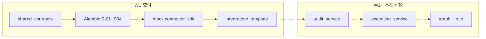

# 预开发说明：W1 基座首轮 — 工程骨架与契约落地

- **日期**：2026-06-25
- **对照契约**：`contracts/openapi/工厂操作系统-v1.1.yaml` · `contracts/schemas/`（16 份）· `contracts/acceptance/验收用例-BASE-001-平台底座.md`
- **架构入口**：`docs/文档/架构/FactoryOS完整架构设计.md` §16 W1 行
- **里程碑口令**：各 Step `可以开始` 前须 **`确认编码门禁，开始 W1`**（仅首轮业务码）

---

## 0. Step 0 全量理解确认单（2026-06-25）

### 执行摘要（≤8 行）

| 项 | 结论 |
|----|------|
| **本轮落点** | W1 工程骨架：`shared_contracts` · Alembic **S-01～S-04** · `connector_sdk` mock · `integration/tenants/_template` 校验；**不含** Graph/Rule/Execution 业务闭环（W2–W3） |
| **写路径** | 本轮无 Legacy 写；仅预埋表 + 契约模型 + mock health；ADR-002 执行红线（`REDLINES.md`）为设计约束，Step 4 前不触达 execution |
| **apps/api** | Step 1 仅 app 工厂 + `/health`；OpenAPI 域路由 W2+ 按模块递增 |
| **integration** | 禁 import os_core 私有 API；本轮 YAML/catalog 契约校验 + 模板完善 |
| **0-DB** | 仓库 **无 Alembic 目录**；本地 PG **未绑定** → Schema 以 `contracts/schemas` + Step 3 迁移为准 |
| **Gate 0 关系** | 52 P0 仍 pending；W1 目标 AC 子集：**S-01～S-04** · **C-01**（mock health）· contract/static 绿 |
| **风险 B 类** | `docs/` 若干文件有未提交改动（架构设计·guide·Playbook·索引·18 矩阵）→ plan 以 `contracts/` 为准；交付前跑 `gate docs-sync` |
| **A 类缺口** | **无** — 可进入规划 |

---

## 1. 迭代目标

**一句话**：搭 W1 可编译、可迁移、可契约测试的工程底座，为 W2 audit/execution 铺路。

**可测要点**：

1. `shared_contracts` 对齐 16 JSON Schema 核心子集（Graph/Rule/Execution/Audit/DslPlan/DomainEvent）
2. Alembic `upgrade head` 满足 **S-01～S-04**（规模预埋表 + 默认 tenant + TenantRegistry + in-process outbox）
3. `connector_sdk` mock 通过 **C-01** healthCheck
4. `./scripts/harness --tier boundaries` 与 import_boundaries 全绿

**不在 W1**：G/R/E 全链路 · agent · mcp · Studio UI · 52 P0 全绿（W8）

---

## 1.1 编码与架构纪律（全程强制）

| 维度 | 要求 |
|------|------|
| **架构合理性** | Modular Monolith；`apps/api` 薄路由；业务只在 `os_core`；integration 仅 OpenAPI + connector_sdk 公开面 |
| **灵活性** | 客户差异不进内核（无 `if tenant_id`）；规模预埋（S-*）用接口抽象（TenantRegistry · OutboxPort），S1 可换实现 |
| **可约定性** | 类型/错误码/API 以 `contracts/` 为准；Pydantic 与 JSON Schema 字段一一对应 |
| **中文注释** | 每 `.py` 文件头 + 函数 docstring + 字段四要素（见 `编码绝对门禁.mdc`） |
| **无重复** | ≥2 处相同逻辑须抽取；禁止 api 重复 os_core 能力 |

---

## 2. AC 对账表

| AC ID | 标题 | 本迭代 | 验证方式 |
|-------|------|--------|----------|
| S-01 | 规模表 migration | **是** Step 3 | pytest `-k 'S-01'` · alembic upgrade |
| S-02 | tenant 默认值 | **是** Step 3 | pytest `-k 'S-02'` |
| S-03 | TenantRegistry | **是** Step 3 | pytest `-k 'S-03'` |
| S-04 | Queue/outbox 接口 | **是** Step 3 | pytest `-k 'S-04'` |
| C-01 | connector healthCheck | **是** Step 4 | pytest `-k 'C-01'` |
| D-01 | DSL registry 列出 | **否**（W2） | — |
| G-01～G-08 | Graph | **否**（W3） | pending |
| E-01～E-09 | Execution | **否**（W2–W3） | pending |
| N-01～N-04 | 安全负向 | **部分** Step 1 | import_boundaries 静态；运行时 N-* W3+ |
| workflow | import_boundaries | **是** Step 1 | `test_import_boundaries_script_passes` |

其余 52 P0：**本 plan 不覆盖**，保持 `@pytest.mark.pending`。

---

## 3. 红线对账

> 红线全文见 `.cursor/factoryos/REDLINES.md`（plan 内不逐条写 R-xx，避免与 AC ID 混淆）。

| 主题 | 本迭代涉及 | 负向测试 / 静态 |
|------|------------|-----------------|
| Agent 禁直写 Legacy | 否（无 agent 写） | E-08 仍 pending |
| 写经 execution_service | 否（无 execution 写） | import 矩阵禁止 orchestrator→connector.write |
| 未 freeze 禁 L2 写 | 否 | G-03 pending |
| Rule 默认 deny | 否 | AC R-01 pending |
| 其余 ADR-002 红线 | 否 | W2+ 运行时 AC |
| **架构** | integration 禁私有 API | `check_import_boundaries.py` 每 Step |

---

## 4. 接口清单（W1 范围）

| 方法 | 路径 | Step | 用途 |
|------|------|------|------|
| GET | `/health` | 1 | 进程存活（非 OpenAPI 正式域） |
| GET | `/v1/connectors/{packId}/health` | 4 | C-01 mock health（OpenAPI 已有） |

其余 `/v1/*`：**本 plan 不实现**（stub 404 可接受直至 W2+）。

---

## 5. 模块与文件

| 模块 | 路径 | 变更 |
|------|------|------|
| 依赖 | `pyproject.toml` · `uv.lock` | + FastAPI · SQLAlchemy 2 async · Alembic · asyncpg |
| 迁移 | `alembic/` · `alembic.ini` | 新建；版本链 S-01～S-04 |
| 契约 | `src/os_core/shared_contracts/` | Pydantic · errors · schema_loader |
| 连接器 | `src/os_core/connector_sdk/` | mock connector + registry 占位 |
| API | `src/apps/api/` | app 工厂 · health · DI 占位 |
| 集成 | `integration/tenants/_template/` | YAML 字段与 SystemRelation schema 对齐 |
| 测试 | `src/tests/contract/` · `src/tests/integration/` | S-* · C-01 · schema 校验 |
| ORM | `src/os_core/shared_contracts/` 或 `apps/api/db/` | tenant/outbox 表模型（与 Schema 字段一致） |

---

## 6. 分步计划

### Step 1 — 工程底座与 import 边界（流程节点：Control Plane CI 就绪）

| 项 | 内容 |
|----|------|
| AC ID | workflow（import_boundaries） |
| 接口 | `GET /health` |
| 模块路径 | `pyproject.toml` · `src/apps/api/main.py` · `src/apps/api/README.md` 更新 |
| Harness 验收盘 | `./scripts/gate step --step 1 -k 'workflow'` |
| 风险 | 依赖封版须同 commit 提交 `uv.lock`；勿提前写 os_core 业务规则 |
| 验收标准 | `uv sync` 绿 · import_boundaries 绿 · pytest workflow 绿 |

**交付物**：FastAPI 最小 app；uv 依赖补齐；无 os_core 业务逻辑。

---

### Step 2 — shared_contracts 核心 Pydantic（流程节点：L0 契约代码化）

| 项 | 内容 |
|----|------|
| AC ID | contract（Schema 对齐）；为 D-01/E-* 预备类型 |
| 接口 | 无新 HTTP |
| 模块路径 | `src/os_core/shared_contracts/models/` · `errors.py` · `schema_loader.py` |
| Harness 验收盘 | `./scripts/gate step --step 2 -k 'contract'` |
| 风险 | Schema 字段与 JSON 不一致 → 以 `contracts/schemas` 为准 |
| 验收标准 | contract pytest 扩展通过 · `./scripts/harness --tier contracts` 绿 |

**优先 Schema**：`执行记录` · `AuditEvent` · `DslPlan` · `业务图谱` · `规则集` · `DomainEvent` · `ExecutionEvidence`

---

### Step 3 — Alembic 规模预埋 S-01～S-04（流程节点：ADR-007 表结构）

| 项 | 内容 |
|----|------|
| AC ID | S-01, S-02, S-03, S-04 |
| 接口 | 无（仅 DB + 内部 Registry） |
| 模块路径 | `alembic/versions/` · `src/os_core/shared_contracts/` 或 `apps/api/db/` · TenantRegistry · OutboxPort |
| Harness 验收盘 | `./scripts/gate step --step 3 -k 'S-01'` |
| 风险 | 无 PG 时 integration test 用 testcontainer/SQLite 策略须在 Test plan 写明 |
| 验收标准 | `alembic upgrade head` 后表存在 · seed tenant · get_cell 返回 cell-default · outbox 可 insert |

**表清单**（AC S-01）：`tenants`（+cell_id/placement_tier/region）· `connector_instances` · `tenant_quotas` · `outbox_events`

---

### Step 4 — mock connector_sdk + integration 模板（流程节点：Connector 接入占位）

| 项 | 内容 |
|----|------|
| AC ID | C-01 |
| 接口 | `GET /v1/connectors/{packId}/health` |
| 模块路径 | `src/os_core/connector_sdk/` · `src/apps/api/routes/connectors.py` · `integration/catalog/` mock · `integration/tenants/_template/` |
| Harness 验收盘 | `./scripts/gate step --step 4 -k 'C-01'` |
| 风险 | connector 不得含业务规则；write 方法 W4 才实现 |
| 验收标准 | C-01 pytest 绿 · boundaries harness 绿 · 52 pending 其余仍红 |

---

## 7. 增量流程图（W1）



---

## 8. Harness 验收盘（全局）

```bash
./scripts/gate plan                              # 确认规划后
./scripts/gate test                              # Test Agent 落 test-plan 后
./scripts/gate step --step 1 -k 'workflow'
./scripts/gate step --step 2 -k 'contract'
./scripts/gate step --step 3 -k 'S-01'
./scripts/gate step --step 4 -k 'C-01'
./scripts/gate pr                                # 整体交付
```

---

## 9. 架构落位（≤10 行）

- **业务域**：Platform-L0 工程底座；无工厂业务 Graph
- **依赖方向**：`apps/api` → `os_core/*` 公开面；`integration/` 仅 HTTP + connector_sdk 公开面
- **为何不漂移**：W1 只做 schemas+迁移+mock；execution 唯一写路径留 W2–W3，避免 premature Legacy 写

---

## 10. 界面字段对账

**不适用**（本轮无 h5/UX）

---

## 11. 下一步（等你关键词）

| 顺序 | 动作 |
|------|------|
| 1 | 你回复 **`确认规划`** → 我更新 state → 你跑 `./scripts/gate plan` |
| 2 | **Test 对话** `【Test模式启动】` + 本 plan 路径 → failing tests |
| 3 | `./scripts/gate test` 绿 |
| 4 | Step 1：`确认编码门禁，开始 W1` + **`可以开始`** |

**plan 路径**：`_factoryos_pipeline/2026-06-25/plan/plan-0116-w1-base.md`
