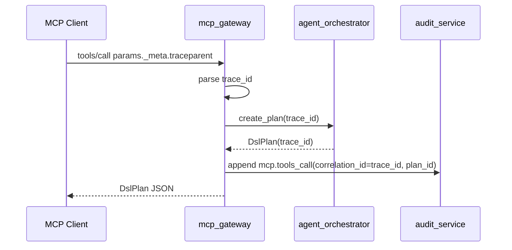

# 预开发说明：W8 — Gate 0 收口（M-03 traceparent · tag core-v1.0.0）

- **日期**：2026-07-02
- **分支**：`dev_sunhailiang_core_260624`（W7 commit `f032aec` 已交付）
- **对照契约**：`contracts/acceptance/验收用例-BASE-001-平台底座.md` · `contracts/openapi/工厂操作系统-v1.1.yaml`
- **规格**：MCP-Gateway §4.1 SEP-414 · 可观测性规范 §2 `mcp.tools.call` span
- **路线图**：`docs/文档/架构/FactoryOS完整架构设计.md` §16 W8 → **52 P0 全 PASS + tag core-v1.0.0**
- **依赖 W7**：mcp_gateway M-01/M-02 · 107 passed（`-m 'not pending'`）· 唯一红测 **M-03**

---

## Step 0 摘要

| 维度 | 结论 |
|------|------|
| **目标** | 实现 **M-03** `_meta.traceparent` 钩子 → plan/audit 同 trace_id；**108 pytest 全绿** → Gate 0 交付 → tag 指引 |
| **不在 W8** | 真实 ERP/钉钉 Connector · MCP OAuth Y2 · H-04/H-05 · Gate 0' 工厂 Graph |
| **写路径** | MCP `tools/call` → `create_plan` → DslPlan；**不经 execution**；与 W7 一致 |
| **DB** | 无新 migration；trace_id 走 DslPlan 可选字段 + audit `correlation_id` |
| **pending** | 仅 **M-03**（`test_ac_pending_until_implemented[M-03]`） |

---

## 1. 迭代目标

**一句话**：补齐 W7 defer 的 **M-03** SEP-414 trace 传播，使 **全量 pytest 108 绿**，完成 Core 1.0 Gate 0 交付仪式（`gate delivery` / `gate pr` / 人工 tag `core-v1.0.0`）。

**Gate 0 判定**（AC-BASE-001 §十四）：52 P0 已在 W1～W7 独立测绿；W8 收口 M-03 + pending 清零 + 终轮回归 → `./scripts/gate delivery`。

---

## 2. AC 对账表

| AC ID | 标题 | Step | Harness |
|-------|------|------|---------|
| M-03 | SEP-414 `_meta.traceparent` | 1 | `-k 'M-03'` |
| 52 P0 存量 | W1～W7 回归 | 1–2 | `-m 'not pending'` → Step2 全量无 pending |
| M-01/M-02 | MCP 不回归 | 1 | 复跑 `test_mcp_w7.py` |

---

## 3. 红线对账

| 红线 | 本迭代涉及 | 负向测试 |
|------|------------|----------|
| R-01 Agent 禁直写 Legacy | MCP call 仍只产 Plan | M-02 回归 |
| H-02 Harness 确认门 | MCP 无 bypass | M-02 Legacy 写计数 0 |
| E-08 orchestrator 禁 connector.write | 不改 import 边界 | `test_dsl_e08_w7.py` 回归 |
| N-03 跨 tenant | 不改 execution 隔离 | Step2 全量回归 |

---

## 4. 接口清单

| 方法 | 路径 | 变更 |
|------|------|------|
| POST | `/mcp/v1/{tenantId}` | `tools/call` params 接受 `_meta.traceparent`（OpenAPI 已有） |
| GET | `/v1/audit/events` | 只读查询；M-03 断言 `correlation_id` / `plan_id` 关联 |

---

## 5. 模块与文件

| 模块 | 路径 | 变更 |
|------|------|------|
| trace 解析 | `shared_contracts/trace_context.py` | **新增** W3C traceparent → trace_id |
| MCP 内核 | `os_core/mcp_gateway/service.py` | 提取 `_meta`，传 trace_id，写 audit |
| orchestrator | `os_core/agent_orchestrator/service.py` | `create_plan(..., trace_id=None)` |
| DslPlan | `shared_contracts/models/dsl.py` + `DslPlan.schema.json` | 可选 `trace_id` 字段 |
| audit | `os_core/audit_service/store.py` | 复用 `append_audit_event` · `mcp.tools_call` |
| 注册表 | `tests/ac/test_base001_registry.py` | M-03 移出 pending（Step1 末） |
| 测试 | `tests/integration/test_mcp_w8.py` | **新增** M-03 红→绿 |

---

## 6. 分步计划

### Step 1 — MCP SEP-414 traceparent（M-03）

| 项 | 内容 |
|----|------|
| AC ID | **M-03** |
| 接口 | `POST /mcp/v1/{tenantId}` · `tools/call` |
| 模块路径 | `shared_contracts/trace_context.py` · `mcp_gateway/service.py` · `agent_orchestrator/service.py` |
| 行为 | 1) 从 `params._meta.traceparent` 解析 32 位 trace_id；2) 写入 DslPlan.trace_id；3) `append_audit_event(event_type=mcp.tools_call, plan_id=..., correlation_id=trace_id)`；4) 无 `_meta` 时行为与 W7 一致 |
| Harness 验收盘 | `./scripts/gate step --step 1 -k 'M-03'` |
| 风险 | schema 增字段须 contract 同步；invalid traceparent 应忽略或 422（plan 定：invalid → 忽略，plan 仍产出） |
| 验收标准 | 带固定 traceparent 的 tools/call → plan.trace_id 与 audit correlation_id 一致 |

**示例 traceparent**（MCP-Gateway 规格）：

```json
{
  "method": "tools/call",
  "params": {
    "name": "GOVERNED_WRITE",
    "arguments": { "tenant_id": "default", "graph_id": "...", "graph_version": "v1.0.0", "intent": "..." },
    "_meta": {
      "traceparent": "00-0af7651916cd43dd8448eb211c80319c-00f067aa0ba902b7-01"
    }
  }
}
```

期望 trace_id = `0af7651916cd43dd8448eb211c80319c`。

### Step 2 — Gate 0 交付仪式

| 项 | 内容 |
|----|------|
| AC ID | 52 P0 全量 + M-03 |
| 动作 | `test_base001_registry` pending 清零 · `change-summary` · 终轮 **108 passed** · tag 指引 |
| Harness 验收盘 | `./scripts/gate delivery` · `./scripts/gate pr` |
| 验收标准 | 无 pending 红测 · summary 落盘 · workflow `DELIVERY` |

**人工 tag**（plan 不自动执行）：

```bash
git tag -a core-v1.0.0 -m "FactoryOS Core 1.0 Gate 0 — AC-BASE-001 52 P0"
git push origin core-v1.0.0
```

---

## 7. 流程图（M-03 数据流）



---

## 8. Harness 验收盘（全局）

```bash
./scripts/gate step --step 1 -k 'M-03'
uv run pytest src/tests/ -q                    # 108 passed, 0 failed
./scripts/gate delivery
./scripts/gate pr
# 人工 tag core-v1.0.0
```

---

## 9. 版本历史

| 版本 | 日期 | 变更 |
|------|------|------|
| v0.1.0 | 2026-07-02 | 初版 W8 · M-03 + Gate 0 收口 |
