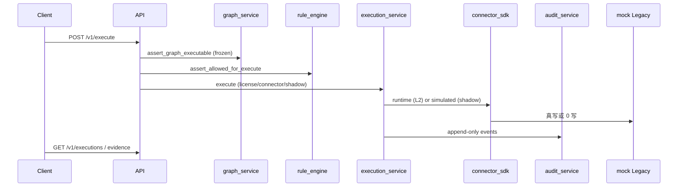

# W1～W8 全量复盘 · Test 终轮兜底验收报告 · Core 1.0 Gate 0

- **范围**：AC-BASE-001 **52 P0 + M-03** · W1 规模预埋 → W8 traceparent 收口
- **命名**：`test-1656-w1-w8-full-regression.md`
- **口令**：`W1~W8 整体回归全量复盘收尾`

## 1. 执行摘要

| 维度 | 结果 |
|------|------|
| 全 suite | **109 passed**, 1 skipped |
| integration | **67 passed** |
| contract + workflow | **42 passed** |
| pending AC | **0**（registry 无红测） |
| `./scripts/gate delivery` | **OK** |
| `./scripts/gate pr` | **OK**（T4.5 full） |

```bash
uv run pytest src/tests/ -v --tb=short          # 109 passed, 1 skipped in 17.23s
uv run pytest src/tests/integration/ -q           # 67 passed
./scripts/gate delivery
./scripts/gate pr
```

## 2. 按迭代业务链路复盘

### W1 — 规模预埋 · Platform Registry 底座

| 文件 | AC | 业务链路 | 结果 |
|------|-----|----------|------|
| `test_scale_s01_s04.py` | S-01～S-04 | migration · tenant seed · cell · outbox | **PASS** |
| `test_connector_c01.py` | C-01 | mock connector health | **PASS** |
| `test_registry_adr008.py` | B-01～B-04 | Platform Registry 18 表 | **PASS** |
| `test_registry_changes_adr008.py` | — | change-request 流程 | **PASS** |

**链路**：Alembic upgrade → tenant/cell 可读 → connector mock 可达。

### W2 — Audit · Execution 写路径

| 文件 | AC | 业务链路 | 结果 |
|------|-----|----------|------|
| `test_audit_e03.py` | E-03 | execute → append-only audit 可查 | **PASS** |
| `test_execution_e01.py` | E-01 | dry_run 执行 | **PASS** |
| `test_execution_e02_e04_e05.py` | E-02/E-04/E-05 | 幂等 · 状态查询 · evidence | **PASS** |
| `test_execution_e06_e07.py` | E-06/E-07 | revert · 补偿路径 | **PASS** |
| `test_execution_e09.py` | E-09 | ExecutionEvidence 组装 | **PASS** |

**链路**：`POST /v1/execute` → execution_record + audit_events → GET execution/evidence。

### W3 — Graph · Rule · DSL 门禁

| 文件 | AC | 业务链路 | 结果 |
|------|-----|----------|------|
| `test_graph_w3.py` | G-01～G-08 | draft/freeze · checksum · allowed_dsl | **PASS** |
| `test_rule_w3.py` | R-01～R-05 | allow/deny · frozen ruleset | **PASS** |
| `test_dsl_w3.py` | D-01～D-03 | CMV 动词 · graph 绑定 | **PASS** |

**链路**：graph freeze + ruleset 绑定 → execute 前 `assert_graph_executable` + `assert_allowed_for_execute`。

### W4 — Connector SDK · Runtime 真写

| 文件 | AC | 业务链路 | 结果 |
|------|-----|----------|------|
| `test_connector_blueprint_w4.py` | C-02～C-04 | Pack blueprint · resolve | **PASS** |
| `test_connector_runtime_w4.py` | — | L2 runtime · mock Legacy 写 | **PASS** |

**链路**：tenant pack 授权 → connector resolve → execution L2 真写（mock）。

### W5 — Agent · Harness 确认门

| 文件 | AC | 业务链路 | 结果 |
|------|-----|----------|------|
| `test_agent_orchestrator_w5_step1.py` | H-01 | intent → DslPlan | **PASS** |
| `test_harness_w5.py` | H-02/H-03 | confirm/reject · 确认前无 Legacy 写 | **PASS** |

**链路**：Agent/MCP 产 Plan → Harness 确认 → 方可 execution 写 Legacy（R-11）。

### W6 — License · Reconciliation

| 文件 | AC | 业务链路 | 结果 |
|------|-----|----------|------|
| `test_license_w6_step1.py` | K-01 | license 门禁 | **PASS** |
| `test_license_t02_w6.py` | K-02/T-02 | MODULE_NOT_LICENSED · audit | **PASS** |
| `test_reconciliation_w6.py` | — | reconcile 漂移检测 | **PASS** |

**链路**：execute 前 `assert_pack_licensed` · license deny → audit LICENSE_DENIED。

### W7 — Shadow · Package · MCP · 负向安全

| 文件 | AC | 业务链路 | 结果 |
|------|-----|----------|------|
| `test_shadow_w7.py` | T-01 | shadow_mode L2 simulated | **PASS** |
| `test_connector_t03_w7.py` | T-03 | CONNECTOR_NOT_CONFIGURED | **PASS** |
| `test_package_w7.py` | P-01～P-03 | export/import · overrides | **PASS** |
| `test_mcp_w7.py` | M-01/M-02 | tools/list · call → Plan 无直写 | **PASS** |
| `test_dsl_e08_w7.py` | D-04/E-08 | CMV 注册 · Agent 禁 connector 写 | **PASS** |
| `test_negative_w7.py` | N-01～N-04 | 旁路/checksum/tenant/SQLi | **PASS** |

**链路**：tenant settings → package 迁移 → MCP stub → 多租户隔离 + param 安全。

### W8 — MCP SEP-414 traceparent（Gate 0 收口）

| 文件 | AC | 业务链路 | 结果 |
|------|-----|----------|------|
| `test_mcp_w8.py` | M-03 | traceparent → plan.trace_id · audit correlation | **PASS** |

**链路**：`params._meta.traceparent` → DslPlan.trace_id + audit `mcp.tools_call`。

## 3. 端到端主写路径（复盘）



| 门禁 | 验证点 | 结果 |
|------|--------|------|
| 无内部旁路 | N-01 `/v1/internal/execute` 404 | ✅ |
| Graph 须 frozen | G-* + N-02 checksum | ✅ |
| Rule 绑定 | R-* deny/allow | ✅ |
| License | K-01/K-02 | ✅ |
| Connector 配置 | T-03 | ✅ |
| Shadow | T-01 simulated | ✅ |
| Harness 确认 | H-02 确认前 Legacy 0 写 | ✅ |
| MCP 不直写 | M-02 | ✅ |
| 跨 tenant | N-03 403 | ✅ |
| param 安全 | N-04 422 | ✅ |
| trace 传播 | M-03 | ✅ |

## 4. 结构与红线门禁

| 项 | 证据 | 结果 |
|----|------|------|
| 13 内核模块 | `test_os_core_registry_lists_kernel_modules` | **PASS** |
| 15 API 域 | `test_api_router_domains_have_usage_metadata` | **PASS** |
| import_boundaries | `test_import_boundaries_script_passes` | **PASS** |
| Agent 禁直写 Legacy | E-08 静态扫描 | **PASS** |
| main 无 include_router | registry harness | **PASS** |
| workflow 联动门禁 | `test_workflow_state_documents_*` | **PASS** |

## 5. AC-BASE-001 对账

| 类别 | 数量 | pending | 结果 |
|------|------|---------|------|
| 52 P0 | 52 | 0 | **全绿** |
| M-03 P1 钩子 | 1 | 0 | **绿** |
| registry skip | — | 1 skipped（空 pending 列表） | **OK** |

## 6. 代码落位终轮评估

| 维度 | 结论 |
|------|------|
| 分层 | os_core 业务 · api 薄路由 · shared_contracts 契约 |
| 写路径 | 唯一写 Legacy：`execution_service` + connector runtime |
| 多租户 | tenant 隔离 execution GET · package per-tenant |
| 可观测 | audit append-only · M-03 trace correlation |
| 重复逻辑 | 未发现 W7/W8 回归暴露的重复门禁 |

## 7. 结论

**结论：通过**

- **W1～W8 全链路回归 109/109 绿**（1 skipped 为 registry 空 pending）
- **gate delivery + gate pr 双绿** · Core 1.0 Gate 0 业务链路正确
- 可 commit / PR · 人工 tag **`core-v1.0.0`**

**下一步**：用户 **`可以提交`** → `git commit` / PR → `git tag -a core-v1.0.0`
