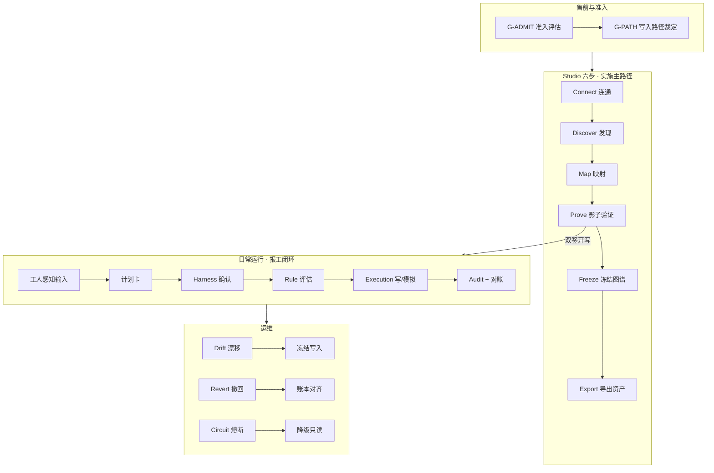
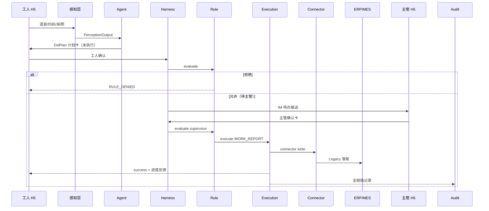

# Ax OS · FactoryOS 产品设计稿

| 项 | 内容 |
|----|------|
| **版本** | v1.0 |
| **日期** | 2026-07-09 |
| **状态** | Accepted（产品/UI 单一阅读入口） |
| **读者** | 产品 · 设计 · 前端 · 实施顾问 |
| **真源层级** | `contracts/` + ADR-000～008 > **本文** > `docs/准备/` |
| **高保真参考** | `docs/设计/ax-os-ui/ax-os-login-v4-smart-hub.png` |
| **Figma 导入套件** | `docs/设计/figma/`（HTML Kit + Tokens + 导入说明） |
| **墨刀交互原型** | `docs/设计/modao/ax-os-prototype.html` + `墨刀原型搭建手册.md` |
| **文档阅读范围** | `docs/` 全量 130 文件递归通读对齐 |

---

## 导读：30 秒看懂本文

Ax OS 是制造业 **智能中枢 Overlay**——在客户 ERP/MES 账本之上，用 **冻结业务图谱 + 规则引擎 + 唯一写路径** 实现「敢写、可追、可回滚」。产品分 **两极**：

- **终端极**（h5-worker）：工人说/扫/拍报工，≤3 次点击
- **配置极**（web-admin / Studio）：实施顾问六步完成接入，无需改 Git

本文给出：**业务流程讲解** → **信息架构** → **页面清单** → **字段/状态/ API** → **Figma 结构表**，足以支撑高保真还原。

---

# 第一部分 · 产品定义

## 1. 产品定位

### 1.1 一句话

**Ax OS（Axis）= 制造业智能中枢系统** — AI 时代 · 全域连接 · 全程可追。

不替代 ERP/MES，接管「人与系统的交互」和「跨系统受控执行」。

### 1.2 我们是什么 / 不是什么

| ✅ 是 | ❌ 不是 |
|--------|--------|
| ERP/MES 之上的 **Governed AI Overlay** | ERP 替代品、无治理聊天机器人 |
| **冻结 Graph + Rule + 唯一写路径 + Audit + Revert** | Agent 直连数据库 / 无审计 iPaaS |
| **部署即资产化**（Package 可复制到第二家） | 装完离场 |
| **单登录入口 + RBAC 裁剪菜单** | 两套 Admin 门户 |
| 工人 **钉钉/企微 H5** 为主入口 | Phase 1 独立 App |

### 1.3 价值主张（对外行业语言）

| 成果 | 用户感知 |
|------|----------|
| 打破孤岛 | ERP/MES/WMS/PLM/OA 经中枢连通，右屏 Hero 可视化 |
| 执行可管 | 每笔写入有规则、有确认、有审计 |
| 决策可追 | 对账零漂移或告警；可撤回 |
| AI 降复杂度 | 说/扫/拍代替菜单树，不是代替账本 |

**禁用对外文案**：售前/接入/Studio 六步等产品内部名；「让制造不再黑箱」「制造业数字中枢」。

### 1.4 D1 只承诺五件事

1. 跨系统 **只读查询**（L0）
2. **受控写**（DSL + Rule + 人工确认）
3. **全链路审计**
4. **可演示撤回**（Revert）
5. **每日对账**（零未解释 drift 或告警）

首条垂直场景：**生产报工**（`graph-work-report` + `skill-work-report-v1`）。

---

## 2. 用户与角色

### 2.1 角色矩阵

| 角色 | 代码 | 典型岗位 | 主入口 | 核心任务 |
|------|------|----------|--------|----------|
| 工人 | `role:worker` | 产线操作工 | h5-worker | 报工、查本单 |
| 班长/主管 | `role:supervisor` | 车间主管 | H5 待办 + web-admin | 确认报工、查异常、撤回 |
| 业务负责人 | `business_owner` | 生产负责人 | web-admin Studio | Graph 冻结签字、开写双签、UAT |
| 实施顾问 | `integrator` | 集成实施 | web-admin `/studio/*` | Studio 六步 onboard |
| 客户 IT | `customer_it` | 信息科 | Studio Connect | 凭证、私网、Edge |
| 租户管理员 | `admin` | 租户 admin | web-admin | shadow 开关、开写批准 |
| 运维 | `ops` | on-call | web-admin 运维域 | drift/revert/熔断 |
| 老板 | `boss` | 高管 | H5 摘要 + PC | 只读问数（Phase 2） |
| 平台研发 | `platform` | 平台团队 | CLI/guide（内部） | 非客户路径 |

### 2.2 入口策略「1+2+1」

| 入口 | 占比 | 应用 |
|------|------|------|
| **主 ~80%** | IM 微应用 | `h5-worker` |
| **管理** | PC Web | `web-admin`（Ax OS 壳 + Studio） |
| **可选** | 工位屏 | 后期 |

**钉死**：`web-admin` **单一登录**；菜单 RBAC + 部署 profile 裁剪；`h5-worker` 独立服务产线操作员。

---

# 第二部分 · 业务流程（核心）

> 本部分面向设计师与前端：**先懂流程，再画界面**。每条流程标注对应页面 ID（见第六部分）。

---

## 3. 总业务流程图



---

## 4. 流程 A · 首家工厂接入（D1 全链路）

**参与者**：实施顾问、客户 IT、业务负责人、平台（按需）  
**周期**：首家 6–9 月（含研发）；同模板第二家 4–8 周或 Silver import 2–3 周  
**目标**：可生产报工、可审计、可撤回、可对账、可导出 Package

### 4.1 阶段 0：准入（G-ADMIT → G-PATH）

| 步骤 | 谁做 | 做什么 | 产出 | 界面 |
|------|------|--------|------|------|
| 0.1 | 实施 + 业务 | 填系统清单（ERP/MES/IM/接口方式） | 《准入评估》 | 售前表单（可线下） |
| 0.2 | 实施 + 平台 | 裁定 Path A/B/C | path 字段 | Studio 创建租户时 **Path 模板选择**（S01） |
| 0.3 | 商务 | 确认 License Pack 列表 | Starter-A/B/B-Lite | 平台治理域（后期） |

**Path 裁定规则**：

| 条件 | Path | 写目标 |
|------|------|--------|
| 有 ERP、无 MES（哈森型） | **A** | ERP 写 + ERP 读 |
| 有 MES | **B** | MES 写 + ERP 只读 |
| 无 ERP/MES | **C** | 内置 PG 账本 |

### 4.2 阶段 1：连通（G-CONNECT）→ 页面 S02 Connect

```text
实施顾问进入 Studio → 选择/创建租户
  → 录入 base_url、secrets_ref（Vault 引用，界面禁止明文密码）
  → 若 ERP 在私网：展示 Edge Agent 状态（在线/离线）
  → 点击「测试连通」
  → 系统调用 POST /v1/integration/connect/test
  → 成功：连通报告 + relation lifecycle=draft
  → 失败：展示 CONNECTOR_NOT_CONFIGURED / EDGE_OFFLINE 等错误卡
```

**业务含义**：此阶段 **禁止任何写操作**，只验证「能读到 Legacy」。

**必显 UI 元素**：
- Path 徽章（A/B/C）
- Edge 状态灯（绿/红/灰）
- 连通报告摘要（延迟、可达 verb 列表）
- Audit 事件 `integration.connect_ok`

### 4.3 阶段 2：发现（G-DISCOVER）→ 页面 S03 Discover

```text
上传厂商 OpenAPI 或选择 catalog Blueprint
  → POST /v1/integration/discover
  → POST /v1/integration/blueprint/validate
  → 展示 CMV 动词候选表（QUERY_WO、WORK_REPORT…）
  → 实施确认候选清单
```

**业务含义**：把「厂商私有 API」对齐到 **标准制造动词（CMV）**，后续 Graph/Rule 只认 CMV。

### 4.4 阶段 3：映射（G-MAP → G-BRONZE-REVIEW）→ 页面 S04 Map

```text
左右对照：DSL 参数字段 ↔ Legacy 字段
  → AI 建议映射 + confidence 分数（须人点确认）
  → PUT /v1/integration/mappings/{packId}
  → 新 Blueprint：须 platform + integrator 人审（G-BRONZE-REVIEW）
```

**业务含义**：字段对齐错误 = 对账 drift 根因之一；UI 必须让差异 **可见、可改、可测**。

### 4.5 阶段 4：验证（G-PROVE → G-WRITE-APPROVE）→ 页面 S05 Prove

**本阶段是 D1 最关键的人审界面。**

```text
tenant.shadow_mode = true（默认）
  → 所有 L2 写 → ExecutionRecord.status = simulated（Legacy 不变）
  → 运行 Contract Test（Pack 级绿灯）
  → 运行对账样例 K-01
  → 持续 Shadow ≥ 14 天
  → 对账无未解释 drift
  → admin + business_owner 在界面双签「批准生产写」
  → Audit: integration.write_approved
  → shadow_mode = false, write_approved = true
```

**Prove 页必含四区块**：

| 区块 | 内容 | 状态 |
|------|------|------|
| Shadow 指示 | 琥珀顶栏「影子模式 · 不会写入 ERP」 | `shadow_mode=true` 时常显 |
| Contract Test | Pack 级用例列表 绿/红 | 全绿才允许双签 |
| 对账报告 | ReconciliationReport 样例 | ok / drift 可解释 |
| 双签区 | 管理员 + 业务负责人电子签 | G-WRITE-APPROVE ❌ 不可自动 |

### 4.6 阶段 5：冻结（G-FREEZE）→ 页面 S06 Freeze

```text
导入行业模板（报工 v0.1 草稿）或 AI 生成 Draft
  → 1–3 场 Graph 工作坊（实施 + 业务负责人）
  → 逐节点确认例外（关班、代报工…）
  → business_owner 在 Studio 签字
  → POST .../graphs/.../freeze
  → status=frozen, checksum 存档
  → Audit: GRAPH_FREEZE
```

**Graph 状态机**（界面须可视化）：

```text
draft → in_review → frozen → deprecated
```

| 状态 | 可编辑 | L2 写 |
|------|--------|-------|
| draft / in_review | ✅ | ❌ |
| frozen | ❌（仅 clone 新版本） | ✅ |
| deprecated | ❌ | ❌ |

### 4.7 阶段 6：导出（G-EXPORT）→ 页面 S07 Export

```text
POST /v1/packages/export
  → 下载 Implementation Package JSON
  → 含：frozen Graph、RuleSet、Pack 列表、Overrides（无 secrets）
  → D1 书面结案附件
```

### 4.8 阶段 7：UAT 与运维移交（G-UAT → G-HANDOVER）

- 试点产线 1 条、工人 20–50 人、UAT 10 项用例
- 交接 Runbook、告警联系人、drift/revert SLA
- 界面：O03 审计时间线、O02 对账看板可供验收方查阅

---

## 5. 流程 B · 日常报工闭环（工人 → 主管 → ERP）

**参与者**：工人、主管、系统（Agent/Rule/Execution）  
**前提**：Graph frozen + write_approved + shadow_mode=false  
**KPI**：工人 P50 ≤30s；报工 → ERP 可见 P95 ≤60s

### 5.1 序列图



### 5.2 工人侧步骤（页面 H01–H07）

| 步 | 用户动作 | 系统行为 | 界面反馈 |
|----|----------|----------|----------|
| 1 | 打开 H5 | 拉当前工单（0 智能，无 ERP 菜单树） | H01 当前工单首页 |
| 2 | 说/扫/拍 | perception → plan | H02/H03/H04 |
| 3 | 置信度低 | 强制澄清或键盘 | H05 大号数字键盘 |
| 4 | 看确认卡 | 展示写什么/多少/可撤回 | H06 确认卡 |
| 5 | 点确认 | harness confirm（工人侧） | 「已提交，待班长确认」 |
| 6 | — | 等待主管 | 工单进度条（D2） |

**确认卡必填字段**（DslPlan）：

- 动作摘要 `summary`
- 工单号、数量（大字号）
- 是否可撤回
- 感知溯源（语音转写/图片缩略图）

### 5.3 主管侧步骤（页面 H08–H09）

| 步 | 动作 | 结果 |
|----|------|------|
| 1 | IM 收到待办 | 打开确认卡 |
| 2 | 批准 | Execution 写 ERP → success |
| 3 | 拒绝 | 无 Legacy 写入 |
| 4 | 24h 内撤回 | WORK_REPORT_REVERT + 原因 |

### 5.4 规则引擎（用户可见逻辑）

**默认拒绝**；无匹配规则 → `RULE_DENIED` 403。

报工规则集（草稿）要点：

- `role:worker` + `WORK_REPORT`：须 `record.confirmed=true`（主管确认后）
- `role:supervisor` + `WORK_REPORT_REVERT`：须 `record.age_hours ≤ 24`
- 老板默认 **无 L2**

---

## 6. 流程 C · 第二家工厂复制（S1 Import）

```text
Studio Import 向导（S08）
  → 上传首家 Export 的 Package
  → 更新 system_relations：secrets_ref、base_url
  → 差异 workshop（仅记录与 Silver 模板 diff）
  → 仍须：G-PROVE（Shadow）+ G-WRITE-APPROVE（双签）
  → 不得跳过治理
```

**界面差异**：Import 向导步骤少于首家；Map 步可折叠（Silver 映射已匹配）。

---

## 7. 流程 D · 运维三板斧

| 事件 | 触发 | 用户看到 | 第一步 | 页面 |
|------|------|----------|--------|------|
| **drift_detected** | 每日对账 | Studio 红标 + IM 告警 | 冻结新写 shadow_mode=true | O02 |
| **revert_failed** | 撤回失败 | 工人端「撤销失败」 | 停同 legacy_ref 重试 | O04 |
| **circuit_open** | Connector 熔断 | 「系统维护」 | 降级 L0 只读 | O05 |

---

# 第三部分 · 产品架构（研发映射）

## 8. 双极 + 三平面

### 8.1 双极

```text
终端智能极          内核门禁极
h5-worker           Graph + Rule + Execution + Audit
体验 ≤3 tap         写路径唯一、默认拒绝
        ╲          ╱
         Harness 确认门
```

### 8.2 三平面

| 平面 | 内容 | 产品可见 |
|------|------|----------|
| Control | ADR、OpenAPI v1.1.1、15 Schema、Playbook | 错误码、动词表 |
| Runtime | os_core 10 模块 + server/api | 执行结果、审计 |
| Config | PostgreSQL Registry（Studio publish） | 所有配置页 |
| External | ERP/MES、Edge、H5、Ax OS Web | 连通状态 |

### 8.3 唯一写路径

```text
Agent/MCP → DslPlan → Harness Confirm → Rule → Execution → Connector → Legacy
                                              ↕ Audit
```

### 8.4 os_core → 用户能力

| 模块 | 用户感知 |
|------|----------|
| graph_service | 图谱状态、冻结锁 |
| rule_engine | 无权/允许提示 |
| execution_service | 成功/模拟/失败/已撤回 |
| audit_service | 时间线 |
| connector_sdk | 健康徽章、熔断 |
| agent_orchestrator | 听懂/看懂 |
| license_service | 未授权模块 |
| platform_registry | Studio 全部配置 |

---

# 第四部分 · 信息架构与视觉

## 9. Ax OS 信息架构

### 9.1 布局槽位

```text
AuthLayout     登录（左表单 + 右行业 Hero）
MainLayout     顶栏 + 侧栏 + 内容区
StudioLayout   六步二级导航（嵌 MainLayout）
PageTemplate   标题区 · KPI 带 · 主区 · 侧辅区
```

### 9.2 侧栏：五行业域（非工程模块名）

| 域 ID | 名称 | 用户问题 | RBAC 默认 |
|-------|------|----------|-----------|
| `domain.mfg` | 制造全景 | 产线今天怎样？ | 全员只读+ |
| `domain.connect` | 产业连接 | 系统怎么连？ | integrator, admin |
| `domain.asset` | 资产与复制 | 经验怎么复制？ | integrator |
| `domain.ops` | 运营与合规 | 敢开写吗？账对吗？ | admin, ops, business_owner |
| `domain.gov` | 平台治理 | 多租户/SaaS？ | admin, platform（SaaS） |

### 9.3 导航树（高保真 IA）

```text
Ax OS
├── 制造全景
│   ├── 首页 Dashboard（L02）
│   ├── 工单概览（D1+）
│   └── 异常看板（D1+）
├── 产业连接
│   └── Integration Studio
│       ├── 租户（S01）
│       ├── ① Connect（S02）
│       ├── ② Discover（S03）
│       ├── ③ Map（S04）
│       ├── ④ Prove（S05）
│       ├── ⑤ Freeze（S06）
│       ├── ⑥ Export（S07）
│       └── Import（S08）
├── 资产与复制
│   ├── Package 导出记录
│   └── Import 向导（S08）
├── 运营与合规
│   ├── Shadow / 开写批准（O01）
│   ├── 对账 Drift（O02）
│   ├── 审计时间线（O03）
│   ├── 执行详情（O04）
│   └── 运维事件（O05）
└── 平台治理（SaaS）
    ├── 租户管理
    ├── License / Pack
    └── 变更审批（S09）
```

---

## 10. 视觉设计系统（Ax OS V4）

### 10.1 品牌

| Token | 值 | 用途 |
|-------|-----|------|
| 产品名 | Ax OS | Logo、登录、浏览器标题 |
| 主标语 | 智能中枢系统 | 登录页、关于 |
| 副标语 | AI 时代 · 全域连接 · 全程可追 | Hero 区 |
| `--ax-bg-default` | `#0A0E1A` | 页面底 |
| `--ax-bg-paper` | `rgba(15,22,40,0.72)` | 玻璃卡片 |
| `--ax-primary` | `#00D4FF` | 强调、连线高光 |
| `--ax-primary-deep` | `#1565C0` ~ `#1E88E5` | Logo 渐变 |
| `--ax-border-glow` | `rgba(0,212,255,0.25)` | 微光描边 |
| `--ax-text-primary` | `#F0F4FF` | 主文字 |
| `--ax-radius-md` | `12px` | 卡片 |
| `--ax-spacing-unit` | `8px` | 栅格基数 |
| 字体 | Inter / PingFang SC | 中英文 |

### 10.2 组件层级（L0–L2）

| 层级 | 组件 | Storybook 必覆盖 |
|------|------|------------------|
| L0 Token | 色/字/间距/圆角/阴影 | 深色主题 |
| L1 壳层 | AuthLayout、MainLayout、侧栏、顶栏、KPI 带 | 默认/折叠 |
| L2 业务件 | 确认卡、Gate 进度条、Shadow 条、Edge 灯、Drift 徽章、错误卡 | 各状态变体 |

**纪律**：`pages/**` 禁止裸 hex；只用 `theme.palette` 或 `var(--ax-*)`。

### 10.3 登录页（L01）构图

```text
┌────────────────────────────────────────────────────────────┐
│  [Ax Logo]  Ax OS                                          │
│                                                            │
│  ┌──────────────┐    ┌──────────────────────────────────┐  │
│  │ 登录表单      │    │  Hero：ERP MES WMS PLM OA 孤岛     │  │
│  │ 智能中枢系统   │    │        ↓ 发光数据流连线 ↓          │  │
│  │ 账号/密码     │    │      [ Ax 中枢核心图形 ]            │  │
│  │ [ 登录 ]      │    │  打破孤岛·执行可管·决策可追·AI降复杂度 │  │
│  └──────────────┘    └──────────────────────────────────┘  │
└────────────────────────────────────────────────────────────┘
```

参考：`ax-os-login-v4-smart-hub.png`

---

# 第五部分 · 页面规格（高保真还原）

## 11. 页面总表

| ID | 名称 | 路由建议 | 优先级 | 关联流程 |
|----|------|----------|--------|----------|
| L01 | 登录 | `/login` | P0 | — |
| L02 | 首页 Dashboard | `/` | P0 | — |
| L03 | 顶栏 | global | P0 | — |
| L04 | 侧栏 IA | global | P0 | — |
| S01 | 租户列表/创建 | `/studio/tenants` | P0 | 流程 A |
| S02 | Connect | `/studio/connect` | P0 | 4.2 |
| S03 | Discover | `/studio/discover` | P0 | 4.3 |
| S04 | Map | `/studio/map` | P0 | 4.4 |
| S05 | Prove | `/studio/prove` | P0 | 4.5 |
| S06 | Freeze | `/studio/freeze` | P0 | 4.6 |
| S07 | Export | `/studio/export` | P0 | 4.7 |
| S08 | Import | `/studio/import` | P1 | 流程 C |
| S09 | 变更审批 | `/studio/change-requests` | P1 | Registry |
| S10 | Gate 进度条 | Studio 内嵌 | P0 | 全局 |
| O01 | Shadow/开写 | `/ops/shadow` | P0 | 4.5 |
| O02 | 对账 Drift | `/ops/reconciliation` | P0 | 流程 D |
| O03 | 审计时间线 | `/ops/audit` | P1 | 4.8 |
| O04 | 执行详情 | `/ops/executions/:id` | P1 | 5 |
| O05 | 运维事件 | `/ops/incidents` | P1 | 流程 D |
| H01–H09 | h5-worker 各页 | h5 路由 | Stage 2 | 流程 B |

---

## 12. 关键页面线框规格

### 12.1 S02 Connect

```text
┌─ Gate 进度条 [●○○○○○] Connect 当前 ─────────────────────┐
├─ Path 徽章 [Path A · ERP 写] ─────────────────────────────┤
├─ 连接器表单 ─────────────────────────────────────────────┤
│  Pack         [conn-erp-kingdee-write ▼]                  │
│  Base URL     [https://...                    ]           │
│  Secrets Ref  [vault://tenant/erp-ref         ]  ⓘ 非明文  │
│  Edge Agent   [edge-01]  ● 在线  上次心跳 12s前              │
├─ [ 测试连通 ]  ────────────────────────────────────────────┤
├─ 连通报告（成功态展开）─────────────────────────────────────┤
│  ✓ QUERY_WO  128ms   ✓ health  OK                         │
└──────────────────────────────────────────────────────────┘
```

**空态**：未选 Pack → 禁用测试按钮  
**错误态**：EDGE_OFFLINE 红卡 + 排查指引  
**API**：`POST /v1/integration/connect/test`

### 12.2 S05 Prove（最重要）

```text
┌─ ⚠ Shadow 模式已开启 · 所有写入仅模拟 ────────────────────┐
├─ Shadow 天数  [████████░░] 12/14 天                       │
├─ Contract Test ───────────────────────────────────────────┤
│  ✓ WORK_REPORT mock    ✓ QUERY_WO    ✗ mapping edge-case   │
├─ 对账样例 ────────────────────────────────────────────────┤
│  状态: ok   匹配键: completed_qty   最近 24h: 0 drift       │
├─ 开写批准（双签）─────────────────────────────────────────┤
│  [ ] 租户管理员 ________________  签署                      │
│  [ ] 业务负责人 ________________  签署                      │
│  [ 批准生产写 ] （双签前 disabled）                          │
└──────────────────────────────────────────────────────────┘
```

**状态变体**：
- `shadow_mode=true`：琥珀顶栏常显
- 未达 14 天：双签按钮 disabled + tooltip
- drift 未解释：红框 + 禁止双签
- 双签完成：绿勾 + 「生产写已批准」

### 12.3 S06 Freeze

```text
┌─ Graph: graph-work-report v0.1.0  [in_review] ────────────┐
├─ 节点画布 / 列表 ─────────────────────────────────────────┤
│  (start) → [查工单] → [工人输入] → [主管确认] → [写报工] → (end) │
├─ checksum: a3f8...   RuleSet: rs-work-report-01  [已绑定]   │
├─ [ 提交审核 ]  [ 冻结并签字 ]  ← business_owner 电子签       │
└──────────────────────────────────────────────────────────┘
```

### 12.4 H06 工人确认卡

```text
┌─────────────────────────┐
│  确认报工                 │
│  工单  WO-2024-0881      │
│  数量  [ 120 ]  件       │
│  撤回  24h 内可撤回       │
│  来源  🎤 语音 · 置信 0.92 │
│  [ 取消 ]    [ 确认提交 ]  │
└─────────────────────────┘
```

---

## 13. 全局状态徽章规范

| 状态键 | 颜色 | 文案 | 出现位置 |
|--------|------|------|----------|
| `shadow_mode` | 琥珀 | 影子模式 · 不会写入 ERP | 顶栏、Prove、H5 |
| `graph.frozen` | 绿+锁 | 链路已冻结 | Freeze、执行页 |
| `edge.offline` | 红 | Edge 离线 | Connect |
| `circuit_open` | 灰 | 系统维护中 | H5、运维 |
| `drift` | 红脉冲 | 对账漂移 | 运营域、主管台 |
| `write_pending` | 蓝 | 待班长确认 | H5 工人 |

---

## 14. 错误展示规范

统一格式：**`CODE · 中文说明`**

| Code | HTTP | 场景 |
|------|------|------|
| `AUTH_STUDIO_FORBIDDEN` | 403 | operator 进 Studio |
| `RULE_DENIED` | 403 | 规则拒绝 |
| `GRAPH_NOT_FROZEN` | 409 | 未冻结就写 |
| `INT_SHADOW_REQUIRED` | 403 | shadow 下禁止真写 |
| `MODULE_NOT_LICENSED` | 403 | 未购 Pack |
| `EDGE_OFFLINE` | 502 | Edge 断连 |
| `MAPPING_ERROR` | 422 | 映射错误 |

---

# 第六部分 · Figma 结构表

> 供设计师直接建 File：Frame 命名 = 下表 `Frame 名`；Component 用 `Comp/` 前缀。

## 15. Figma File 结构

```text
📁 Ax-OS-FactoryOS-v1.0
├── 📄 Cover（版本/日期/真源链接）
├── 📄 00-Design-Tokens
│   ├── Colors / Dark
│   ├── Typography
│   ├── Spacing & Radius
│   └── Elevation & Glow
├── 📄 01-Components
│   ├── Comp/Button/Primary|Secondary|Ghost
│   ├── Comp/Input/Text|Password|Select
│   ├── Comp/Card/Glass|KPI
│   ├── Comp/Badge/Path|Gate|Status
│   ├── Comp/Alert/Error|Warning|Success
│   ├── Comp/Progress/Gate-6|Shadow-14d
│   ├── Comp/ConfirmCard/Worker|Supervisor
│   ├── Comp/EdgeStatus/Online|Offline
│   └── Comp/Sidebar/Item|Group
├── 📄 02-Layouts
│   ├── Layout/Auth
│   ├── Layout/Main-Sidebar-Expanded
│   ├── Layout/Main-Sidebar-Collapsed
│   └── Layout/Studio-Subnav
├── 📄 03-Flows（业务流程图 · 给评审用）
│   ├── Flow/D1-Onboard
│   ├── Flow/WorkReport-Loop
│   ├── Flow/Import-Second-Factory
│   └── Flow/Ops-Incident
├── 📄 04-Screens-Web
│   ├── L01-Login/Default
│   ├── L02-Dashboard/Default
│   ├── S01-Tenants/List|Create
│   ├── S02-Connect/Empty|Testing|Success|EdgeOffline
│   ├── S03-Discover/Upload|Candidates
│   ├── S04-Map/Editing|AI-Suggest|Error
│   ├── S05-Prove/ShadowOn|Day12|Drift|DualSign|Approved
│   ├── S06-Freeze/Draft|InReview|Frozen
│   ├── S07-Export/Wizard|Done
│   ├── S08-Import/Wizard
│   ├── O01-Shadow/Toggle
│   ├── O02-Reconciliation/Ok|Drift
│   └── O04-Execution/Detail|Reverted
├── 📄 05-Screens-H5
│   ├── H01-Home/WithWO|Empty
│   ├── H02-Voice/Listening|LowConfidence
│   ├── H03-Scan/Camera
│   ├── H05-Keypad
│   ├── H06-ConfirmCard
│   ├── H07-Success/PendingSupervisor
│   └── H08-Supervisor/Todo|Batch
└── 📄 99-Prototype
    ├── Proto/D1-Happy-Path（S01→S07）
    ├── Proto/WorkReport（H01→H07→H08）
    └── Proto/Drift-Response（O02→O01）
```

## 16. 组件变体矩阵（必做）

| 组件 | Variant 属性 | 值 |
|------|-------------|-----|
| `Comp/Badge/Path` | path | A, B, C |
| `Comp/Badge/Gate` | auto | auto, semi, manual |
| `Comp/Badge/Status` | type | shadow, frozen, drift, circuit, licensed |
| `Comp/Progress/Gate-6` | step | 1–6, current |
| `Comp/ConfirmCard` | role | worker, supervisor |
| `Comp/EdgeStatus` | state | online, offline, unknown |
| `Comp/Button/Primary` | state | default, disabled, loading |

## 17. 原型连线（评审用）

| 原型名 | 起点 | 终点 | 说明 |
|--------|------|------|------|
| D1-Happy-Path | S01 创建租户 | S07 下载 Package | 实施顾问主路径 |
| WorkReport | H01 | H08 主管批准 | 日常闭环 |
| Prove-Block | S05 drift | 双签 disabled | 负路径 |
| Import | S08 | S05 仍须 Prove | 第二家不跳治理 |

---

# 第七部分 · 数据与 API

## 18. 核心实体 → 屏幕

| 实体 | Schema | 主要页面 |
|------|--------|----------|
| BusinessGraph | 业务图谱.schema.json | S06 |
| RuleSet | 规则集.schema.json | S06 |
| SystemRelation | SystemRelation.schema.json | S02 |
| DslPlan | DslPlan.schema.json | H06, H08 |
| ExecutionRecord | 执行记录.schema.json | O04, H07 |
| ReconciliationReport | ReconciliationReport.schema.json | O02, S05 |
| ImplementationPackage | ImplementationPackage.schema.json | S07, S08 |
| AuditEvent | AuditEvent.schema.json | O03 |

## 19. API 接线速查

| 页面 | 端点 |
|------|------|
| S02 | `POST /v1/integration/connect/test` |
| S03 | `POST /v1/integration/discover`, `.../blueprint/validate` |
| S04 | `PUT /v1/integration/mappings/{packId}` |
| S05 | `POST /v1/integration/prove/run`, `PUT /v1/tenants/{id}/settings` |
| S06 | `POST /v1/graphs/.../freeze` |
| S07 | `POST /v1/packages/export` |
| S08 | `POST /v1/packages/import` |
| H02–H06 | `POST /v1/perception/*` → `/v1/agent/plan` → `/v1/harness/confirm` |
| O02 | `POST /v1/reconciliation/run` |
| O03 | `GET /v1/audit/events` |
| O04 | `GET /v1/executions/{id}/evidence` |

---

# 第八部分 · 验收与分期

## 20. 设计稿 ↔ 验收对齐

| 验收套件 | 设计必须覆盖 |
|----------|-------------|
| **STU-001** | S02–S07、无 YAML 上线、RBAC、双签 |
| **UX-001** | H01–H08、确认门、≤3 tap、多模态兜底 |
| **MVP-001** | 报工 Path A/B 全链路 |
| **BASE-001** | Graph 状态机、shadow、revert、对账 |

## 21. 研发分期

```text
1b-0   Ax OS 壳 + Token + IA（L01–L04）+ Storybook L1/L2
1b-1   Studio Connect + Discover（S02–S03）
1b-2   Map + Prove（S04–S05）← 人审最重
1b-3   Freeze + Export（S06–S07）
Stage2 h5-worker（H01–H09）
Stage3 灯塔项目 Path A 验证
```

## 22. 高保真还原自检（设计交付前）

- [ ] 登录符合 V4：Ax OS · 智能中枢 · 深空青蓝 · 右 Hero 行业连接
- [ ] 侧栏五 **行业域**，无工程模块名
- [ ] Studio 六步 + Gate 进度条 + 人审 Gate 标 ❌
- [ ] Prove 含 Shadow 条 / 14 天 / 对账 / 双签四区块
- [ ] 全局状态徽章与第十三节一致
- [ ] 确认卡：动作 · 数量 · 可撤回 · 来源
- [ ] secrets 仅 ref，无明文密码
- [ ] h5：0 智能首页 · 语音失败兜底 · 主管待办
- [ ] Figma 含 03-Flows 业务流程页 + 99-Prototype 三条主原型
- [ ] 错误态每页至少 1 个 Variant

---

## 附录 A · 业务图谱报工模板（冻结前参考）

```text
start → 查工单(QUERY_WO) → 工人输入(skill-work-report-v1)
     → 主管确认 → 写(WORK_REPORT) → 审计
     → 撤回网关(WORK_REPORT_REVERT, ≤24h) → end
```

## 附录 B · 文档索引

| 类型 | 路径 |
|------|------|
| 架构总览 | `docs/文档/架构/FactoryOS完整架构设计.md` |
| Studio 规格 | `docs/文档/规格说明/Integration-Studio规格.md` |
| 人工 Gate | `docs/文档/规格说明/人工决策Playbook.md` |
| 终端体验 | `docs/文档/规格说明/Harness终端体验.md` |
| 验收 STU | `docs/文档/验收/验收用例-STU-001-Studio配置主路径.md` |
| OpenAPI | `docs/文档/接口/工厂操作系统-v1.1.yaml` |
| UI 定稿图 | `docs/设计/ax-os-ui/` |

---

**变更记录**

| 版本 | 日期 | 变更 |
|------|------|------|
| v1.0 | 2026-07-09 | 初版：全量 docs 对齐 + 业务流程 + 高保真页面规格 + Figma 结构表 |
