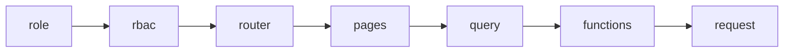

# plan-<HHmm>-<slug>.md

## 元信息

| 项 | 值 |
|----|-----|
| 日期 | YYYY-MM-DD |
| 目标 | |
| module-id | |
| AC | WEB-PROFILE W-xx |
| 边界 | 无越权 / 须确认越权 |
| 结构 | 无变更 / 须确认结构变更 |

## 需求与 AC 对账

| AC ID | 验收标准 | Step |
|-------|----------|------|

## 红线对账（WEB-REDLINES）

| 红线 | 本需求 |
|------|--------|

## 数据流（Mermaid）

## Step 列表

### Step 1 — <名>

- **路径**：`src/...`
- **AC**：W-xx
- **验收盘**：`check_boundary_lock` · `check_harness` · `pnpm vitest run ...`
- **风险**：

## 确认项

- [ ] 无 FactoryOS 越权写
- [ ] 无未授权结构变更
- [ ] Test failing tests 已规划
