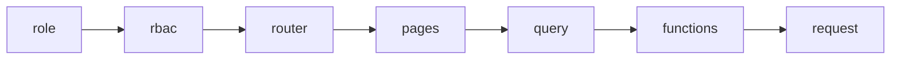

# plan-<HHmm>-<slug>.md（WEB plan v2）

- **类型**：新功能 / Bug修复 / 重构优化
- **材料准入**：`materials-<HHmm>-<slug>.md` 或 `N/A（Bug/…）`

## 元信息

| 项 | 值 |
|----|-----|
| 日期 | YYYY-MM-DD |
| 目标 | |
| module-id | |
| AC | WEB-PROFILE W-xx |
| 边界 | 无越权 / 须确认越权 |
| 结构 | 无变更 / 须确认结构变更 |

## 2. 需求与 AC 对账

| AC ID | 验收标准 | Step |
|-------|----------|------|

## 3. 红线对账（WEB-REDLINES）

| 红线 | 本需求 |
|------|--------|

## 4. Step 总览（必填 · 一眼看全部分步）

| Step | 名称 | 解决什么问题 | 路径/模块 | 验收盘 |
|------|------|--------------|-----------|--------|
| 1 | | | `src/...` | boundary · harness · vitest |

## 5. 数据流（Mermaid）

## 6. Step 列表

### Step 1 — <名>

- **路径**：`src/...`
- **AC**：W-xx
- **功能 / 问题**：
- **验收盘**：`check_boundary_lock` · `check_harness` · `pnpm vitest run ...`
- **风险**：

## 8. UI / 原型字段对账

- **命中判定**：否 / 是
- 命中=是时填字段表；禁止「待实现/未知/未确认」

## 确认项

- [ ] 无 FactoryOS 越权写
- [ ] 无未授权结构变更
- [ ] Test failing tests 已规划
- [ ] 已 `材料已齐` + `./scripts/web_gate materials`
